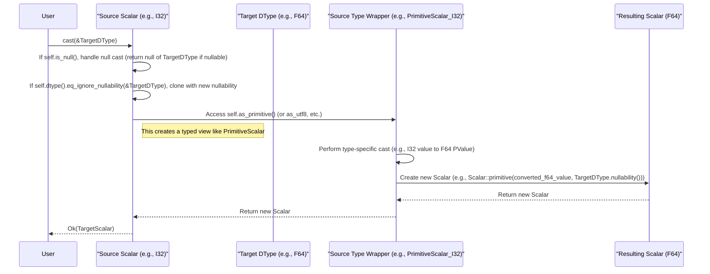

# Chapter 2: Scalar (`Scalar`)

In the [previous chapter on DType (`DType`)](01_dtype___dtype___.md), we explored how Vortex defines the logical types of data. A `DType` tells us *what kind* of data we are dealing with (e.g., a 32-bit integer, a UTF-8 string, a list of booleans), including its nullability. However, `DType` alone doesn't represent an actual data value. This chapter introduces the `Scalar` abstraction, which bridges this gap by representing a single, logical data value, intrinsically paired with its `DType`.

Scalars are fundamental in Vortex for several reasons:
1.  They represent constant values, such as in a `ConstantArray` where every element is the same.
2.  They are the result of `scalar_at` operations, which retrieve a single element from an [Array (`ArrayRef`, `dyn Array`)](03_array___arrayref____dyn_array___.md).
3.  They serve as literal values in computations (e.g., adding `5` to a column of numbers) and are used to store singular statistical values like minimum or maximum within [Statistics (`Stat`, `StatsSet`)](07_statistics___stat____statsset___.md).

## The Structure of a `Scalar`

At its core, a `Scalar` in Vortex is a simple structure that combines two essential pieces of information: the logical data type (`DType`) and the actual value (`ScalarValue`).

```rust
// Relevant excerpt from vortex-scalar/src/lib.rs
#[derive(Debug, Clone)]
pub struct Scalar {
    dtype: DType,
    value: ScalarValue,
}
```
Here:
*   `dtype: DType`: This field, an instance of the `DType` enum discussed in Chapter 1, specifies the logical type of the scalar value. It dictates how the `value` field should be interpreted and what operations are valid.
*   `value: ScalarValue`: This field holds the actual data for the scalar. The `ScalarValue` itself is an opaque container; its meaning is only fully understood in conjunction with the `dtype`.

This pairing ensures that a scalar value is always self-describing in terms of its logical type.

## `ScalarValue`: The Untyped Value Container

The `ScalarValue` struct is a wrapper around an internal enum, `InnerScalarValue`, which holds the raw data for the various types of scalars Vortex supports.

```rust
// Relevant excerpt from vortex-scalar/src/scalar_value/mod.rs
#[derive(Debug, Clone)]
pub struct ScalarValue(pub(crate) InnerScalarValue);

#[derive(Debug, Clone)]
pub(crate) enum InnerScalarValue {
    Null,
    Bool(bool),
    Primitive(PValue),
    Decimal(DecimalValue),
    Buffer(Arc<ByteBuffer>),      // For Binary data
    BufferString(Arc<BufferString>), // For Utf8 data
    List(Arc<[ScalarValue]>),    // For List data (and Struct data internally)
}
```
Let's examine the variants of `InnerScalarValue`:
*   `Null`: Represents a null value.
*   `Bool(bool)`: Holds a boolean (`true` or `false`).
*   `Primitive(PValue)`: Stores primitive numeric types (like integers and floats) using the `PValue` enum. `PValue` itself can represent various primitive types (e.g., `PValue::I32(i32)`, `PValue::F64(f64)`).
*   `Decimal(DecimalValue)`: Holds fixed-precision decimal values.
*   `Buffer(Arc<ByteBuffer>)`: Contains binary data (a sequence of bytes), typically for `DType::Binary`. `Arc<ByteBuffer>` allows for efficient sharing of byte data. The [Buffer (`Buffer`, `ByteBuffer`)](08_buffer___buffer____bytebuffer___.md) abstraction will be covered later.
*   `BufferString(Arc<BufferString>)`: Contains UTF-8 encoded string data, typically for `DType::Utf8`. `BufferString` is a wrapper around `ByteBuffer` ensuring UTF-8 validity.
*   `List(Arc<[ScalarValue]>)`: Represents a list of other `ScalarValue`s, used for `DType::List`. Structs are also represented internally as a list of scalar values for their fields. The `Arc` enables efficient sharing of the list's content.

It's crucial to understand that `ScalarValue` on its own is just a container for data. It's the associated `DType` within the `Scalar` struct that provides the context for interpreting this data correctly. For example, a `ScalarValue::Primitive(PValue::I64(10))` could be part of an `i64!` scalar or, if the `DType` indicates an `i32!`, a conversion would be implied during access.

## Creating `Scalar` Instances

Vortex provides several ways to create `Scalar` instances.

### General Constructor
The most direct way is using `Scalar::new()`:
```rust
use vortex_scalar::{Scalar, ScalarValue, PValue};
use vortex_dtype::{DType, PType, Nullability};

// Creating an F64 scalar with value 3.14
let f64_dtype = DType::Primitive(PType::F64, Nullability::NonNullable);
let f64_value = ScalarValue::from(PValue::F64(3.14)); // PValue directly into ScalarValue
let pi_scalar = Scalar::new(f64_dtype, f64_value);

println!("Pi scalar: {:?}, DType: {}", pi_scalar, pi_scalar.dtype());
```
Output:
```
Pi scalar: Scalar { dtype: f64!, value: 3.14f64 }, DType: f64!
```
This requires constructing the `DType` and `ScalarValue` explicitly.

### Null Scalars
To create a scalar representing a `null` value for a specific nullable `DType`:
```rust
use vortex_scalar::Scalar;
use vortex_dtype::{DType, PType, Nullability};

let nullable_i32_type = DType::Primitive(PType::I32, Nullability::Nullable);
let null_scalar = Scalar::null(nullable_i32_type.clone());

println!("Null scalar: {:?}, Is null: {}", null_scalar, null_scalar.is_null());
```
Output:
```
Null scalar: Scalar { dtype: i32?, value: null }, Is null: true
```
The `Scalar::null()` constructor asserts that the provided `DType` must be nullable.

### Typed Constructors and `From` Traits
For convenience, Vortex offers typed constructors and leverages Rust's `From` trait extensively.
For primitive types:
```rust
use vortex_scalar::Scalar;
use vortex_dtype::Nullability;

// Using Scalar::primitive helper
let int_scalar = Scalar::primitive(42i32, Nullability::NonNullable);
println!("Int scalar from helper: {:?}", int_scalar);

// Using From<i32> for Scalar (implies NonNullable)
let another_int_scalar: Scalar = 42i32.into();
println!("Int scalar from From<i32>: {:?}", another_int_scalar);

// For Option<T>, it creates a nullable Scalar
let opt_int_scalar: Scalar = Some(100i32).into();
println!("Some(i32) scalar: {:?}, Is null: {}", opt_int_scalar, opt_int_scalar.is_null());

let none_int_scalar: Scalar = Option::<i32>::None.into();
println!("None::<i32> scalar: {:?}, Is null: {}", none_int_scalar, none_int_scalar.is_null());
```
Output:
```
Int scalar from helper: Scalar { dtype: i32!, value: 42i32 }
Int scalar from From<i32>: Scalar { dtype: i32!, value: 42i32 }
Some(i32) scalar: Scalar { dtype: i32?, value: 100i32 }, Is null: false
None::<i32> scalar: Scalar { dtype: i32?, value: null }, Is null: true
```
Similar `From` implementations exist for `String`, `&str` (for `Utf8Scalar`), `Vec<u8>` (for `BinaryScalar`), and other relevant types, making scalar creation ergonomic. For example, `Scalar::from("hello")` creates a non-nullable Utf8 scalar.

## Accessing Data from Scalars

Once you have a `Scalar`, you'll want to access its properties and underlying value.

Basic accessors include:
*   `scalar.dtype() -> &DType`: Returns a reference to the scalar's logical type.
*   `scalar.value() -> &ScalarValue`: Returns a reference to the raw `ScalarValue`.
*   `scalar.is_null() -> bool`: Checks if the scalar represents a null value.
*   `scalar.is_valid() -> bool`: The opposite of `is_null()`.

To access the typed value, Vortex provides type-specific wrapper structs (e.g., `PrimitiveScalar`, `BoolScalar`, `Utf8Scalar`). These are typically obtained using `as_...()` or `as_..._opt()` methods:

```rust
use vortex_scalar::Scalar;
use vortex_dtype::Nullability;

let greeting_scalar: Scalar = "Hello Vortex".to_string().into(); // Creates Utf8Scalar

if let Some(utf8_s) = greeting_scalar.as_utf8_opt() {
    // utf8_s is of type Utf8Scalar
    if let Some(value_str) = utf8_s.value_opt() {
        println!("String value: {}", value_str);
    }
}

let num_scalar = Scalar::primitive(123.45f32, Nullability::NonNullable);
if let Some(primitive_s) = num_scalar.as_primitive_opt() {
    // primitive_s is of type PrimitiveScalar
    if let Some(value_f32) = primitive_s.typed_value::<f32>() {
        println!("F32 value: {}", value_f32);
    }
}
```
Output:
```
String value: Hello Vortex
F32 value: 123.45
```
These wrapper structs (`PrimitiveScalar`, `Utf8Scalar`, etc.) provide a type-safe API to interact with the scalar's data according to its `DType`. For instance, `PrimitiveScalar` offers methods to get the specific `PType`, the `PValue`, or the value cast to a concrete Rust numeric type.

## Type-Specific Scalar Wrappers

As hinted above, Vortex uses a pattern of type-specific wrapper structs for `Scalar`s. These wrappers are found in `vortex-scalar/src/` in files like `primitive.rs`, `utf8.rs`, `bool.rs`, etc.

Consider `PrimitiveScalar`:
```rust
// Simplified from vortex-scalar/src/primitive.rs
#[derive(Debug, Clone, Copy)] // It's a lightweight view
pub struct PrimitiveScalar<'a> {
    dtype: &'a DType,      // Reference to the Scalar's DType
    ptype: PType,          // The specific PType
    pvalue: Option<PValue>,// The actual primitive value, or None if null
}

impl<'a> PrimitiveScalar<'a> {
    // Method to get the value as a specific Rust native type
    pub fn typed_value<T: NativePType + TryFrom<PValue, Error = VortexError>>(&self) -> Option<T> {
        // ... implementation to convert self.pvalue to T ...
        // Example: self.pvalue.map(|pv| pv.as_primitive::<T>().unwrap())
        // Actual implementation handles errors and type checks.
        unimplemented!()
    }
    // ... other methods like ptype(), pvalue(), arithmetic operations ...
}
```
These wrappers (e.g., `PrimitiveScalar`, `Utf8Scalar`, `ListScalar`) are crucial because they:
1.  Provide a type-safe API. For example, you can only call string-specific methods on a `Utf8Scalar`.
2.  Handle potential coercions. If a `ScalarValue` stores a `PValue::I64` but the `DType` is `I32`, `PrimitiveScalar::typed_value::<i32>()` would handle the downcast (or error if out of range).
3.  Encapsulate logic specific to that scalar type (e.g., arithmetic for primitives, element access for lists).

They are typically obtained via `TryFrom<&'a Scalar>` or helper methods like `scalar.as_primitive()`.

## Operations on `Scalar`

Scalars support various operations, chief among them being comparison and casting.

### Equality and Comparison
`Scalar` implements `PartialEq`, `Eq`, `PartialOrd`, and `Hash`.
*   **Equality (`eq`)**: Two scalars are equal if their `DType`s are equivalent ignoring nullability, and their values are equal. Null scalars of the same underlying type are equal.
*   **Ordering (`partial_cmp`)**: Comparison is generally defined only if the `DType`s are equivalent ignoring nullability. Nulls are typically ordered as less than non-null values. The specific ordering depends on the type (e.g., numeric order for primitives, lexicographical for strings).

```rust
use vortex_scalar::Scalar;
use vortex_dtype::Nullability;

let s1 = Scalar::primitive(10i32, Nullability::NonNullable);
let s2 = Scalar::primitive(20i32, Nullability::NonNullable);
let s3 = Scalar::primitive(10i32, Nullability::Nullable); // Same value, different nullability

println!("s1 == s2: {}", s1 == s2); // false
println!("s1 == s3: {}", s1 == s3); // true (value and DType kind match)
println!("s1 < s2: {}", s1 < s2);   // true
```

### Casting
Scalars can be cast to different `DType`s using the `cast(&target_dtype)` method. This is a common operation when preparing data for computations or storage.

```rust
use vortex_scalar::Scalar;
use vortex_dtype::{DType, PType, Nullability};

let int_scalar = Scalar::primitive(42i32, Nullability::NonNullable);
let target_f64_type = DType::Primitive(PType::F64, Nullability::Nullable);

match int_scalar.cast(&target_f64_type) {
    Ok(casted_scalar) => {
        println!("Original DType: {}, Casted DType: {}", int_scalar.dtype(), casted_scalar.dtype());
        // Accessing the casted value:
        if let Some(val_f64) = casted_scalar.as_primitive().typed_value::<f64>() {
            println!("Casted value: {}", val_f64);
        }
    }
    Err(e) => println!("Cast failed: {}", e),
}
```
Output:
```
Original DType: i32!, Casted DType: f64?
Casted value: 42
```
The casting logic is quite comprehensive:
*   Null scalars can be cast to any other nullable `DType`.
*   Primitive types can be cast between each other (e.g., `i32` to `f64`, `u8` to `i64`), with overflow/precision loss checks.
*   Strings can be cast to numeric types if parseable, and vice-versa.
*   Casting to/from [Extension (`EncodingRef`, `VTable` trait and macro)](04_encoding___encodingref____vtable__trait_and_macro__.md) types involves casting the underlying storage scalar.

## Internal Implementation of `Scalar` Operations

Let's look under the hood at how some `Scalar` operations are implemented.

### Obtaining Type-Specific Wrappers
When you call `scalar.as_primitive()`, it internally attempts to convert the generic `Scalar` into a `PrimitiveScalar`.
```rust
// Simplified from vortex-scalar/src/primitive.rs
// impl<'a> TryFrom<&'a Scalar> for PrimitiveScalar<'a>
// This is usually called by scalar.as_primitive() or scalar.as_primitive_opt()

// public fn try_new(dtype: &'a DType, value: &ScalarValue) -> VortexResult<Self>
// Inside PrimitiveScalar::try_new(dtype, value):
// 1. Check if dtype is actually a DType::Primitive. If not, error.
// 2. Extract the PType from the DType.
// 3. Access the InnerScalarValue from `value`.
// 4. If InnerScalarValue is Null, pvalue becomes None.
// 5. If InnerScalarValue is Primitive(pval), convert/validate pval against the DType's PType.
//    For example, if DType is I32 but pval is I64(val), try to convert val to i32.
// 6. Return PrimitiveScalar { dtype, ptype, pvalue: Some(converted_pvalue) } or error.
```
This `try_new` (or `TryFrom`) pattern is common for all type-specific scalar wrappers.

### Scalar Casting Workflow
The `scalar.cast(&target_dtype)` method orchestrates the conversion. Here's a simplified flow for casting a non-null `Scalar`:


Key steps involve:
1.  Handling nulls: If the source scalar is null, the result is a null scalar of the target type (if nullable, otherwise an error).
2.  No-op cast: If the source and target `DType`s are fundamentally the same (ignoring nullability), the value is preserved, and only the `DType` (potentially its nullability) is updated.
3.  Delegation: Otherwise, the cast is delegated to the type-specific wrapper of the source scalar (e.g., `PrimitiveScalar::cast`, `Utf8Scalar::cast`). These methods contain the logic for converting values between types (e.g., numeric promotion, string parsing).
4.  Extension Types: If casting to or from an `ExtDType`, the cast typically operates on the underlying storage scalar.

## Role of `Scalar` in the Vortex Ecosystem

`Scalar` objects are not just standalone entities; they play vital roles in interaction with other Vortex components:

*   **`ConstantArray`**: An array where all elements are identical can be efficiently represented by a single `Scalar` and the array's length. This is a common optimization for repetitive data. This will be explored further in the chapter on [Array (`ArrayRef`, `dyn Array`)](03_array___arrayref____dyn_array___.md).
*   **`scalar_at` Operation**: When you need to access a single element from any Vortex [Array (`ArrayRef`, `dyn Array`)](03_array___arrayref____dyn_array___.md) at a specific index, the `scalar_at` method returns a `Scalar`. This provides a unified way to retrieve individual values regardless of the array's underlying encoding.
*   **Literals in Computations**: In query engines or computation kernels, literal values (e.g., the `5` in `column + 5`) are often represented as `Scalar`s. This allows [Compute Kernels (`ComputeFn`, `Kernel` trait, various specific kernel traits)](05_compute_kernels___computefn____kernel__trait__various_specific_kernel_traits__.md) to operate uniformly on array-array, array-scalar, or scalar-array inputs.
*   **Statistics**: Metadata like minimum, maximum, or sum for an array or a column segment are often stored as `Scalar`s within a [Statistics (`Stat`, `StatsSet`)](07_statistics___stat____statsset___.md) object. This allows for type-safe storage and retrieval of these aggregate values.

## Serialization of `Scalar`

Like `DType`, `Scalar` instances need to be serializable for persistence or network transmission. Vortex uses Protocol Buffers (protobuf) for this, defined in the `vortex-proto` crate.

The protobuf definition for `Scalar` includes its `DType` and `ScalarValue`:
```protobuf
// Conceptual snippet from vortex-proto/src/generated/vortex.scalar.rs
// (actual .proto definitions are in .proto files, this reflects generated Rust)

// message DType { ... } // Defined in vortex.dtype, see Chapter 1

message Scalar {
  optional DType dtype = 1;
  optional ScalarValue value = 2;
}

message ScalarValue {
  oneof kind {
    // For DType::Null, google.protobuf.NullValue is used.
    // For DType::Bool
    bool bool_value = 2;

    // For DType::Primitive, values might be stored as wider types
    // or a more complex PValue-like structure. Simplified here:
    sint64 int64_value = 3;     // Example for integer PValues
    double f64_value = 6;       // Example for float PValues

    // For DType::Utf8
    string string_value = 7;
    // For DType::Binary
    bytes bytes_value = 8;
    // For DType::List (and Structs, which are list-like)
    ListValue list_value = 9;
    // Other variants for Decimal, etc. would exist
  }
}

message ListValue {
  repeated ScalarValue values = 1;
}
```
The `ScalarValue` protobuf message uses a `oneof` field to represent the different kinds of values, mirroring the `InnerScalarValue` Rust enum. The exact representation of primitive values in protobuf might be more nuanced to efficiently handle all `PType`s. The `ScalarValue` struct in Rust provides `to_protobytes()` and `from_protobytes()` for serialization and deserialization.

## Conclusion

The `Scalar` is Vortex's representation of a single, typed data value. By pairing a `ScalarValue` (the raw data) with a `DType` (its logical type), `Scalar` provides a self-describing and type-safe way to handle individual data items. Its role is crucial for representing constants, literal values in expressions, results of single-element lookups, and statistical aggregates. The use of type-specific wrappers like `PrimitiveScalar` and `Utf8Scalar` offers a convenient and safe API for interacting with scalar data.

Having understood how logical types (`DType`) are defined and how individual values of these types (`Scalar`) are represented, we are now ready to explore how collections of these scalars are organized into [Array (`ArrayRef`, `dyn Array`)](03_array___arrayref____dyn_array___.md), the primary data structure for columnar data in Vortex.

---

Generated by [AI Codebase Knowledge Builder](https://github.com/The-Pocket/Tutorial-Codebase-Knowledge)
