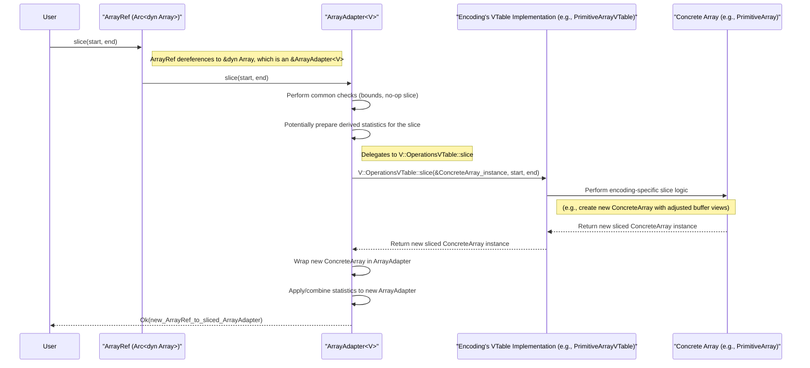

# Chapter 3: Array (`ArrayRef`, `dyn Array`)

In the [previous chapter on Scalar (`Scalar`)](02_scalar___scalar___.md), we explored how Vortex represents individual, typed data values. While scalars are essential for constants, literals, and single-value lookups, data processing systems primarily operate on collections of data. This chapter introduces the `Array` abstraction, the cornerstone of Vortex's in-memory columnar data representation.

The `Array` in Vortex is more than just a sequence of values; it's a sophisticated structure that embodies Vortex's core design principle: the separation of logical data type from physical memory encoding. An `Array` provides a typed view over memory buffers, and this view can be realized through various physical encodings—such as run-length encoding for repetitive data, dictionary encoding for low-cardinality columns, or simple contiguous buffers for primitive types. Regardless of the underlying encoding, an `Array` consistently presents data according to its logical [DType (`DType`)](01_dtype___dtype___.md).

Polymorphism over these different encodings is achieved through the `dyn Array` trait object, and safe, shared access is managed by `ArrayRef`, a reference-counted smart pointer. `ArrayRef` is the fundamental unit of data manipulation and computation within the Vortex ecosystem, enabling efficient and flexible data processing.

## Core Concepts of a Vortex Array

A Vortex `Array` is characterized by several key components, as outlined in the conceptual overview (`docs/concepts/arrays.md`):

1.  **Logical Data Type (`DType`)**: Every array has an associated [DType (`DType`)](01_dtype___dtype___.md) that defines the logical type of its elements. This `DType` is independent of how the data is physically stored. For example, an array of `DType::Primitive(PType::I32, Nullability::Nullable)` logically contains nullable 32-bit integers, whether they are stored as a raw buffer, compressed, or dictionary-encoded.

2.  **Length (`len`)**: This is the number of logical elements in the array. It's a fundamental property used in iteration, slicing, and validation.

3.  **Encoding (`EncodingRef`)**: Each array is associated with a specific [Encoding (`EncodingRef`, `VTable` trait and macro)](04_encoding___encodingref____vtable__trait_and_macro__.md). The encoding dictates the physical layout of the array's data in memory and provides the actual implementation for operations on the array (e.g., accessing an element, slicing).

4.  **Children (`children`)**: Some encodings are composite, meaning they are built from other arrays. For example, a `StructArray` has child arrays for each of its fields, and a `DictionaryArray` has a child array for unique values and another for codes. These children are themselves `ArrayRef`s.

5.  **Buffers (`buffers`)**: At the lowest level, array data resides in one or more [Buffer (`Buffer`, `ByteBuffer`)](08_buffer___buffer____bytebuffer___.md) instances. These are contiguous blocks of memory. The interpretation of these buffers is determined by the array's encoding.

6.  **Metadata (`metadata`)**: Encodings may require specific metadata to interpret their children or buffers. This is typically a small byte buffer. For instance, a dictionary encoding might store the `DType` of its codes child in its metadata.

7.  **Statistics (`statistics`)**: Arrays can carry pre-computed [Statistics (`Stat`, `StatsSet`)](07_statistics___stat____statsset___.md) about their data, such as min/max values, null counts, or whether the data is sorted. These statistics can be used to optimize computations.

```mermaid
graph TD
    Array["Array (Logical View)"] --> DType["DType (Logical Type)"];
    Array --> Length["Length (Number of Elements)"];
    Array --> Encoding["Encoding (Physical Layout & Behavior)"];
    Array --> Children["Children (Child Arrays, e.g., Struct Fields)"];
    Array --> Buffers["Buffers (Raw Memory Blocks)"];
    Array --> Metadata["Metadata (Encoding-Specific)"];
    Array --> Stats["Statistics (Min, Max, Null Count, etc.)"];

    Encoding --> VTable["VTable (Implements Array Operations)"];

    style Array fill:#lightblue,stroke:#333,stroke-width:2px
    style DType link:"01_dtype___dtype___.md"
    style Encoding link:"04_encoding___encodingref____vtable__trait_and_macro__.md"
    style Buffers link:"08_buffer___buffer____bytebuffer___.md"
    style Stats link:"07_statistics___stat____statsset___.md"
```

## The `Array` Trait and `ArrayRef`

The primary interface for interacting with arrays in Vortex is the `Array` trait, defined in `vortex-array/src/array/mod.rs`. This trait specifies the common operations that all array types must support.

```rust
// Simplified excerpt from vortex-array/src/array/mod.rs
use vortex_dtype::DType;
use vortex_error::VortexResult;
use vortex_scalar::Scalar;
use crate::{EncodingRef, EncodingId, Canonical};
use std::sync::Arc;
use std::any::Any;

pub trait Array: 'static + Send + Sync + std::fmt::Debug /* + other supertraits */ {
    fn as_any(&self) -> &dyn Any;
    fn to_array(&self) -> ArrayRef; // Essentially clones the ArrayRef
    fn len(&self) -> usize;
    fn dtype(&self) -> &DType;
    fn encoding(&self) -> EncodingRef;
    fn encoding_id(&self) -> EncodingId;
    fn slice(&self, start: usize, end: usize) -> VortexResult<ArrayRef>;
    fn scalar_at(&self, index: usize) -> VortexResult<Scalar>;
    fn is_valid(&self, index: usize) -> VortexResult<bool>;
    // ... many other methods like to_canonical(), statistics(), etc.
}

// ArrayRef is the primary way to pass arrays around.
pub type ArrayRef = Arc<dyn Array>;
```
This trait defines the contract for all array implementations. Key methods include:
*   `len()`: Returns the number of elements in the array.
*   `dtype()`: Returns a reference to the array's logical [DType (`DType`)](01_dtype___dtype___.md).
*   `encoding()`: Returns an `EncodingRef` identifying the array's specific [Encoding (`EncodingRef`, `VTable` trait and macro)](04_encoding___encodingref____vtable__trait_and_macro__.md).
*   `encoding_id()`: Returns the unique `EncodingId` for the array's encoding.
*   `slice(start, end)`: Creates a new `ArrayRef` representing a sub-section of the original array. This operation aims to be zero-copy or very low-cost, often by adjusting pointers and length metadata rather than copying data.
*   `scalar_at(index)`: Retrieves the element at the given index as a [Scalar (`Scalar`)](02_scalar___scalar___.md). This is the bridge between collective array operations and individual value access.
*   `is_valid(index)`: Checks if the element at `index` is null (invalid) or not null (valid).
*   `to_canonical()`: Converts the array to its [Canonical Encodings (`Canonical`)](06_canonical_encodings___canonical___.md) form. This is crucial for operations that expect data in a standard, uncompressed layout.
*   `statistics()`: Provides access to the array's [Statistics (`Stat`, `StatsSet`)](07_statistics___stat____statsset___.md).
*   `as_any()` and downcasting: `as_any()` allows casting to `&dyn Any`, which is then used with `downcast_ref` or helper methods like `array.as_::<V: VTable>()` to get a concrete array type if its encoding is known.

The type alias `ArrayRef = Arc<dyn Array>` is ubiquitous in Vortex.
*   `Arc`: Ensures thread-safe shared ownership of array data. Arrays can be large, so cloning an `ArrayRef` is cheap (it just bumps a reference count), allowing arrays to be passed around efficiently.
*   `dyn Array`: Enables polymorphism. An `ArrayRef` can point to any concrete array type (e.g., `PrimitiveArray`, `CompressedArray`, `DictionaryArray`) as long as it implements the `Array` trait. This allows functions to operate on arrays without needing to know their specific encoding.

## `ArrayAdapter<V: VTable>`: Bridging Concrete Types and the Trait

The `Array` trait is an object-safe trait, meaning it can be used to create trait objects (`dyn Array`). However, the actual implementations of array logic (like how to perform a slice or retrieve a scalar) are specific to each encoding. These encoding-specific implementations are defined via a [Encoding (`EncodingRef`, `VTable` trait and macro)](04_encoding___encodingref____vtable__trait_and_macro__.md) (Virtual Table).

The `ArrayAdapter<V: VTable>` struct in `vortex-array/src/array/mod.rs` acts as a bridge:
```rust
// Simplified from vortex-array/src/array/mod.rs
// V is a type that implements the VTable trait for a specific encoding.
#[repr(transparent)]
pub struct ArrayAdapter<V: VTable>(V::Array);

// ArrayAdapter implements the Array trait.
// Its methods typically delegate to the VTable implementation associated with V.
impl<V: VTable> Array for ArrayAdapter<V> {
    fn len(&self) -> usize {
        // Calls the len function from the VTable's ArrayVTable part
        <V::ArrayVTable as ArrayVTable<V>>::len(&self.0)
    }

    fn slice(&self, start: usize, stop: usize) -> VortexResult<ArrayRef> {
        // ... performs some common checks and logic ...
        // Then delegates to the VTable's OperationsVTable part
        let sliced_inner_array = <V::OperationsVTable as OperationsVTable<V>>::slice(&self.0, start, stop)?;
        // ... wraps the result back into an ArrayRef ...
        // For simplicity, assume sliced_inner_array can be wrapped into an ArrayAdapter
        // and then into an ArrayRef. The actual code handles stats propagation too.
        Ok(Arc::new(ArrayAdapter(sliced_inner_array)) as ArrayRef)
    }
    // ... other Array trait methods implemented similarly ...
}
```
`ArrayAdapter` is a wrapper around a concrete array struct (like `PrimitiveArray`, `BoolArray`, etc., denoted by `V::Array`). Because `ArrayAdapter` is `#[repr(transparent)]`, it has the same memory layout as the `V::Array` it wraps. This allows for efficient casting. The `VTable` (which we'll explore in Chapter 4) provides the concrete implementations for methods like `len`, `slice`, `scalar_at`, etc., for the specific encoding `V`.

When you have an `ArrayRef`, and you call a method like `array_ref.len()`, you are invoking the `ArrayAdapter`'s implementation of `len()`, which in turn calls the specific `len` function provided by the `VTable` for that array's encoding.

## Example: Structure of `DateTimePartsArray`

Let's look at a concrete example, the `DateTimePartsArray` from `encodings/datetime-parts/src/array.rs`. This array isn't a canonical encoding but rather a specialized one for datetime components.

```rust
// Simplified from encodings/datetime-parts/src/array.rs
use vortex_array::{ArrayRef, Array, EncodingRef, vtable};
use vortex_dtype::DType;
use vortex_error::VortexResult;
// ... other imports

// Defines the VTable for DateTimePartsArray
vtable!(DateTimeParts);

// The concrete struct for DateTimePartsArray
#[derive(Clone, Debug)]
pub struct DateTimePartsArray {
    dtype: DType,      // Logical DType (e.g., Timestamp)
    days: ArrayRef,    // Child array for days component
    seconds: ArrayRef, // Child array for seconds component
    subseconds: ArrayRef, // Child array for subseconds component
    // ... stats_set ...
}

impl DateTimePartsArray {
    // Constructor
    pub fn try_new(
        dtype: DType,
        days: ArrayRef,
        seconds: ArrayRef,
        subseconds: ArrayRef,
    ) -> VortexResult<Self> {
        // ... validation logic for dtypes and lengths of children ...
        Ok(Self { dtype, days, seconds, subseconds, /* ... */ })
    }

    // Accessors for children
    pub fn days(&self) -> &ArrayRef { &self.days }
    // ... similar for seconds, subseconds ...
}

// Implementation of ArrayVTable part of the VTable for DateTimePartsArray
// This provides basic array properties.
impl ArrayVTable<DateTimePartsVTable> for DateTimePartsVTable {
    fn len(array: &DateTimePartsArray) -> usize {
        array.days.len() // Length is derived from one of its children
    }

    fn dtype(array: &DateTimePartsArray) -> &DType {
        &array.dtype
    }
    // ... stats ...
}
```
The `DateTimePartsArray` stores its data across three child `ArrayRef`s: `days`, `seconds`, and `subseconds`. Its logical `DType` might be something like a timestamp. Its length is determined by the length of its child arrays (which must all be equal). Operations like `scalar_at` on a `DateTimePartsArray` would involve fetching corresponding scalars from each child array and combining them.

This illustrates how complex array types can be composed from simpler ones, all unified under the `ArrayRef` and `dyn Array` abstractions.

## Key Operations on Arrays

Let's delve into some fundamental operations provided by the `Array` trait.

### Slicing (`slice`)
Slicing creates a new view onto a portion of an existing array. It's a critical operation for batch processing and windowed computations.
```rust
use vortex_array::{Array, ArrayRef, canonical::Canonical, DType, PType, Nullability};
use vortex_error::VortexResult;
use std::sync::Arc;

fn example_slice(array: ArrayRef) -> VortexResult<()> {
    if array.len() >= 10 {
        // Create a slice from index 2 up to (but not including) index 7
        let sliced_array: ArrayRef = array.slice(2, 7)?;
        println!(
            "Original length: {}, Sliced length: {}",
            array.len(),
            sliced_array.len()
        );
        // sliced_array now represents elements original_array[2]...original_array[6]
        // The DType and Encoding (usually) remain the same.
        assert_eq!(sliced_array.len(), 5);
    }
    Ok(())
}

// Dummy array for demonstration
let primitive_array = Canonical::primitive_from_vec(
    (0..20i32).collect::<Vec<_>>(),
    Nullability::NonNullable
).into_array();
example_slice(primitive_array).unwrap();
```
Output:
```
Original length: 20, Sliced length: 5
```
The `slice` operation is typically very efficient as it often avoids data copying. For many encodings, it involves creating a new array object that references the same underlying buffers but with adjusted offsets and length. Statistics might also be adjusted or recomputed for the sliced portion.

### Element Access (`scalar_at`)
To retrieve an individual data element from an array, you use `scalar_at(index)`. This returns a [Scalar (`Scalar`)](02_scalar___scalar___.md) object.
```rust
use vortex_array::{Array, ArrayRef, Canonical, DType, PType, Nullability};
use vortex_error::VortexResult;
use vortex_scalar::Scalar;
use std::sync::Arc;

fn example_scalar_at(array: &ArrayRef, index: usize) -> VortexResult<()> {
    if index < array.len() {
        let scalar_value: Scalar = array.scalar_at(index)?;
        println!(
            "Scalar at index {}: {:?} (DType: {})",
            index,
            scalar_value, // Scalar's Debug impl shows value and DType
            scalar_value.dtype()
        );
    } else {
        println!("Index {} is out of bounds for array of length {}", index, array.len());
    }
    Ok(())
}

let string_values = vec![Some("hello"), None, Some("vortex")];
let string_array = Canonical::utf8_from_iter(string_values, Nullability::Nullable).into_array();

example_scalar_at(&string_array, 0).unwrap();
example_scalar_at(&string_array, 1).unwrap();
```
Output:
```
Scalar at index 0: Scalar { dtype: utf8?, value: "hello" } (DType: utf8?)
Scalar at index 1: Scalar { dtype: utf8?, value: null } (DType: utf8?)
```
`scalar_at` handles decoding the value from its physical representation (which might be compressed or indirect) into a logical `Scalar`. If the value at the index is null, it returns a null `Scalar` of the array's `DType`.

### Conversion to Canonical Form (`to_canonical`)
While Vortex excels at operating directly on various encodings, sometimes a standard, uncompressed representation is needed. The `to_canonical()` method converts any array to its corresponding [Canonical Encodings (`Canonical`)](06_canonical_encodings___canonical___.md) form.
```rust
use vortex_array::{Array, ArrayRef, Canonical, DType, PType, Nullability};
use vortex_error::VortexResult;
use std::sync::Arc;

fn example_to_canonical(array: &ArrayRef) -> VortexResult<()> {
    println!("Original encoding: {}", array.encoding_id());
    let canonical_array_wrapper: Canonical = array.to_canonical()?;
    // canonical_array_wrapper is an enum (Canonical) that wraps a canonical array.
    // We can get an ArrayRef from it:
    let canonical_array_ref: ArrayRef = canonical_array_wrapper.into_array();
    println!("Canonical encoding: {}", canonical_array_ref.encoding_id());
    // Now canonical_array_ref is in a standard format (e.g., PrimitiveArray, VarBinViewArray)
    Ok(())
}

// Imagine 'my_compressed_array' is an ArrayRef with some custom compression.
// For this example, we'll just use a primitive array which is already canonical.
let my_compressed_array = Canonical::primitive_from_vec(
    vec![1i32, 2, 3], Nullability::NonNullable
).into_array();

example_to_canonical(&my_compressed_array).unwrap();
```
Output:
```
Original encoding: vortex.primitive
Canonical encoding: vortex.primitive
```
If `my_compressed_array` had a non-canonical encoding (e.g., `vortex.rle` for Run-Length Encoding), `to_canonical()` would decompress it into the appropriate canonical form (e.g., `vortex.primitive` for RLE-encoded integers). This operation might involve memory allocation and data transformation if the original array is not already in canonical form.

### Nullability and Validity
The `Array` trait provides methods to query the validity (non-nullness) of its elements:
*   `is_valid(index)`: Checks a single element.
*   `all_valid()`: Checks if all elements are non-null.
*   `invalid_count()`: Returns the total number of null elements.
*   `validity_mask()`: Returns a `Mask` object (often a bitmask) representing the validity of all elements.

These operations are crucial for computations that need to handle nulls correctly. The actual validity information might be stored in various ways depending on the encoding (e.g., a separate bitmap buffer, or implicitly if the encoding guarantees no nulls).

## Internal Implementation: Method Dispatch via `ArrayAdapter`

When a method like `slice` is called on an `ArrayRef`, the call is dispatched through the `ArrayAdapter` to the specific implementation provided by the array's `VTable`.

Let's trace a call to `array.slice(start, end)`:



The `ArrayAdapter::slice` method, as seen in `vortex-array/src/array/mod.rs`, handles several general concerns:
1.  **Boundary Checks**: Ensures `start` and `end` are valid.
2.  **No-Op Slice**: If `start == 0 && end == len()`, it can return a clone of the original `ArrayRef`.
3.  **Empty Slice**: If `start == end`, it returns an empty array of the same `DType`.
4.  **Statistics Propagation**: It attempts to derive statistics for the sliced array from the original array's statistics to avoid recomputing them if possible. For example, if an array is sorted, a slice of it is also sorted.
5.  **Delegation**: The core slicing logic, specific to the array's encoding, is invoked via `<V::OperationsVTable as OperationsVTable<V>>::slice(&self.0, start, stop)`. `self.0` here refers to the wrapped concrete array instance (e.g., a `PrimitiveArray`).
6.  **Result Wrapping**: The concrete sliced array returned by the `VTable` is then wrapped back into an `ArrayAdapter` and an `ArrayRef`, and statistics are finalized.

This layered approach allows common logic to reside in `ArrayAdapter`, while encoding-specific details are handled by the respective `VTable` implementations.

## Owned vs. Viewed Arrays

Vortex supports the concept of "owned" versus "viewed" arrays.
*   **Owned arrays** are typically heap-allocated and fully materialized in memory.
*   **Viewed arrays** can be lazily unwrapped from an underlying representation, such as a [Buffer (`Buffer`, `ByteBuffer`)](08_buffer___buffer____bytebuffer___.md) containing data in a format like Apache FlatBuffers. This is particularly useful for efficiently loading and working with very wide schemas or accessing parts of large datasets without deserializing everything into memory upfront.

This distinction is largely an internal optimization and is abstracted away from the user by the `Array` trait. Whether an `ArrayRef` points to an owned or viewed array, it presents the same interface.

## Conclusion

The Vortex `Array`, accessed via `ArrayRef` and the `dyn Array` trait, is the fundamental data structure for representing columnar data. It achieves a powerful separation of logical data type from physical encoding, enabling flexibility in storage and performance optimizations like computation on compressed data. Through the `ArrayAdapter` and `VTable` mechanism, Vortex supports a diverse range of array encodings under a unified interface. Operations like slicing, element access, and conversion to canonical forms are essential tools for data manipulation.

Understanding the `Array` abstraction is key to working with data in Vortex. The next chapter will delve deeper into what defines the physical structure and behavior of these arrays: the [Encoding (`EncodingRef`, `VTable` trait and macro)](04_encoding___encodingref____vtable__trait_and_macro__.md). This will illuminate how different physical representations are managed and how they provide the concrete implementations for the `Array` trait methods.

---

Generated by [AI Codebase Knowledge Builder](https://github.com/The-Pocket/Tutorial-Codebase-Knowledge)
