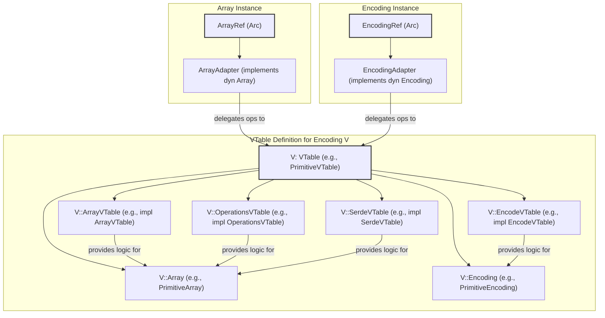
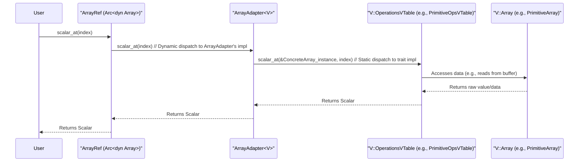

# Chapter 4: Encoding (`EncodingRef`, `VTable` trait and macro)

In the [previous chapter on Array (`ArrayRef`, `dyn Array`)](03_array___arrayref____dyn_array___.md), we learned that a Vortex `Array` provides a logical, typed view over a collection of data. It answers "what" the data is (its [DType (`DType`)](01_dtype___dtype___.md), its length). However, the `Array` trait itself doesn't dictate *how* this data is physically stored in memory or *how* operations like accessing an element or slicing are performed. This crucial role is fulfilled by the **Encoding** system in Vortex.

Encodings define the physical representation of array data and implement the specific logic for operations on that data. This might involve compression (like Run-Length Encoding), specialized sparse formats, or simple contiguous primitive buffers. The power of Vortex lies in its ability to support a multitude of encodings under a unified `Array` interface, enabling operations directly on compressed or specialized data formats. This is achieved through a dynamic dispatch mechanism based on Virtual Tables (VTables), making Vortex highly extensible to new storage schemes. `EncodingRef` provides a way to manage these dynamic encoding types.

## The Essence of an Encoding

An Encoding in Vortex specifies two primary aspects:

1.  **Physical Data Layout**: How the array's data (values and validity) is organized in memory using [Buffer (`Buffer`, `ByteBuffer`)](08_buffer___buffer____bytebuffer___.md)s and potentially child [Array (`ArrayRef`, `dyn Array`)](03_array___arrayref____dyn_array___.md)s.
2.  **Operational Logic**: The concrete implementation of methods defined by the `Array` trait (e.g., `scalar_at`, `slice`, `to_canonical`) for its specific data layout.

For example, a `PrimitiveArray` (a canonical encoding for primitive types) will store its data in a simple, contiguous buffer. Its `scalar_at` implementation will directly read a value from this buffer. In contrast, a `RunLengthEncoding` (RLE) array will store runs of values and their corresponding lengths. Its `scalar_at` implementation will first determine which run an index falls into and then return the value for that run. Both present a unified `Array` interface to the user.

This separation allows Vortex to:
*   Choose the most efficient storage format for different kinds of data.
*   Perform computations directly on compressed or specialized formats, avoiding unnecessary decompression.
*   Easily add new compression algorithms or storage layouts without altering the core `Array` abstraction or consuming code.

## The `Encoding` Trait

The central abstraction for encodings is the `Encoding` trait, found in `vortex-array/src/encoding.rs`. This trait defines a common contract that all specific encoding types (like `PrimitiveEncoding`, `DictionaryEncoding`, etc.) must adhere to.

```rust
// Simplified from vortex-array/src/encoding.rs
use vortex_buffer::ByteBuffer;
use vortex_dtype::DType;
use vortex_error::VortexResult;
use crate::{ArrayRef, Canonical, ArrayChildren};
use std::any::Any;
use std::fmt::Debug;
use std::sync::Arc;
use arcref::ArcRef; // For EncodingRef

pub type EncodingId = ArcRef<str>; // Globally unique name
pub type EncodingRef = ArcRef<dyn Encoding>; // Reference-counted pointer

pub trait Encoding: 'static + Send + Sync + Debug {
    fn id(&self) -> EncodingId; // Returns the unique ID, e.g., "vortex.primitive"

    // Build an array of this encoding from its constituent parts
    fn build(
        &self,
        dtype: &DType,
        len: usize,
        metadata: &[u8],
        buffers: &[ByteBuffer],
        children: &dyn ArrayChildren, // Helper to access child arrays
    ) -> VortexResult<ArrayRef>;

    // Encode a canonical array into this encoding format
    fn encode(&self, input: &Canonical, like: Option<&dyn Array>)
    -> VortexResult<Option<ArrayRef>>;

    fn as_any(&self) -> &dyn Any;
    fn to_encoding(&self) -> EncodingRef; // Clone into an EncodingRef
    // ... other methods
}
```
Key methods of the `Encoding` trait include:
*   `id()`: Returns a globally unique string identifier for the encoding (e.g., `"vortex.rle"`, `"vortex.dict"`). This ID is crucial for serialization and identifying encoding types.
*   `build()`: Constructs an `ArrayRef` of this encoding from its fundamental components: its logical [DType (`DType`)](01_dtype___dtype___.md), length, metadata, raw [Buffer (`Buffer`, `ByteBuffer`)](08_buffer___buffer____bytebuffer___.md)s, and child [Array (`ArrayRef`, `dyn Array`)](03_array___arrayref____dyn_array___.md)s. This is used, for example, when loading an array from disk.
*   `encode()`: Takes an array in its [Canonical Encodings (`Canonical`)](06_canonical_encodings___canonical___.md) form and attempts to convert (encode) it into this specific encoding. The `like` parameter can provide an existing array of the target encoding to reuse its parameters (e.g. dictionary). This is how compression is applied. It returns `None` if the input `Canonical` array is not suitable for this encoding (e.g., wrong DType).

The type alias `EncodingRef = ArcRef<dyn Encoding>` defines a reference-counted, dynamically-typed pointer to an `Encoding` object. `ArcRef` is a specialized `Arc` that allows for more efficient cloning of the reference to the string ID. This `EncodingRef` is what an `Array` typically holds to know its encoding.

## The `VTable` Mechanism: Dynamic Dispatch for Array Operations

While the `Encoding` trait defines an encoding *type*, it doesn't directly house the implementations for all array operations like `slice` or `scalar_at`. These operations are part of the `Array` trait. To connect an `Array`'s methods to the specific logic of its encoding, Vortex uses a Virtual Table (VTable) mechanism.

A VTable is essentially a collection of function pointers (or, in Rust, trait implementations) that provide the concrete logic for a set of operations. Each encoding in Vortex has an associated set of VTable implementations.

The core `VTable` trait (from `vortex-array/src/vtable/mod.rs`) acts as a central registry for these implementations:
```rust
// Simplified from vortex-array/src/vtable/mod.rs
use crate::{Array, EncodingId, EncodingRef, IntoArray};
use std::fmt::Debug;
use std::ops::Deref;

// These are examples of sub-VTable traits (actual list is longer)
pub trait ArrayVTable<V: VTable>: Send + Sync { /* methods like len, dtype */ }
pub trait OperationsVTable<V: VTable>: Send + Sync { /* methods like slice, scalar_at */ }
// ... other traits like CanonicalVTable, SerdeVTable, ComputeVTable etc.

// The main VTable trait that an encoding's VTable marker struct implements
pub trait VTable: 'static + Sized + Send + Sync + Debug {
    // Associated type for the concrete array struct (e.g., PrimitiveArray)
    type Array: 'static + Send + Sync + Clone + Deref<Target = dyn Array> + IntoArray;
    // Associated type for the concrete encoding struct (e.g., PrimitiveEncoding)
    type Encoding: 'static + Send + Sync + Clone; // Deref<Target = dyn Encoding> removed for simplicity

    // Links to specific VTable implementations
    type ArrayVTable: ArrayVTable<Self>;
    type OperationsVTable: OperationsVTable<Self>;
    // ... other VTable associated types like CanonicalVTable, SerdeVTable ...

    fn id(encoding: &Self::Encoding) -> EncodingId;
    fn encoding(array: &Self::Array) -> EncodingRef;
}
```
This `VTable` trait itself doesn't contain methods like `slice` or `scalar_at`. Instead, it defines associated types (e.g., `ArrayVTable`, `OperationsVTable`) which point to other traits that *do* define these methods. A specific encoding (say, "Primitive") will:
1.  Define a marker struct (e.g., `PrimitiveVTable`).
2.  Implement `VTable` for `PrimitiveVTable`. This involves specifying its concrete array type (`PrimitiveArray`), its concrete encoding type (`PrimitiveEncoding`), and which structs implement the sub-VTables (e.g., `type ArrayVTable = PrimitiveArrayVTableImpl;`).
3.  The struct `PrimitiveArrayVTableImpl` would then implement `ArrayVTable<PrimitiveVTable>`, providing the actual functions for `len`, `dtype`, etc., for `PrimitiveArray`.

This structure organizes the extensive set of functions an encoding might support. The main `Array` methods (like `len`, `slice`) are typically dispatched via `ArrayAdapter<V: VTable>` which calls the appropriate function from the VTable associated with `V`. Similarly, `Encoding` methods are dispatched via `EncodingAdapter<V: VTable>`.

A simplified view of this interaction:


## Key Sub-VTables

The `VTable` trait groups several more specific VTable traits, each responsible for a category of operations. Some important ones include:
*   **`ArrayVTable`**: Defines basic properties of an array, such as `len()`, `dtype()`, `statistics()`, `is_empty()`.
*   **`OperationsVTable`**: Implements core data manipulation operations like `slice()`, `scalar_at()`, `take()` (gather elements by index).
*   **`ValidityVTable`**: Handles nullability, providing methods like `is_valid()`, `null_count()`.
*   **`CanonicalVTable`**: Manages conversion to and from the [Canonical Encodings (`Canonical`)](06_canonical_encodings___canonical___.md) representation of the array. For example, `to_canonical()` decompresses the array.
*   **`SerdeVTable`**: Deals with serialization and deserialization of the array's metadata and structure (excluding raw buffer data which is handled separately). Its `build()` method is called by `Encoding::build()`.
*   **`EncodeVTable`**: Provides the `encode()` function to compress a canonical array into this specific encoding. This is called by `Encoding::encode()`.
*   **`ComputeVTable`**: A collection of VTables for various compute kernels (e.g., `filter`, arithmetic operations). This will be explored in [Compute Kernels (`ComputeFn`, `Kernel` trait, various specific kernel traits)](05_compute_kernels___computefn____kernel__trait__various_specific_kernel_traits__.md).

Each encoding provides implementations for the VTables relevant to it. For instance, an encoding that doesn't support compression wouldn't need to implement `EncodeVTable`.

## The `vtable!` Macro

Defining a new encoding involves creating a concrete array struct (e.g., `MyArray`), a concrete encoding struct (e.g., `MyEncoding`), and a VTable marker struct (e.g., `MyVTable`), then implementing all the VTable traits. To reduce boilerplate, Vortex provides the `vtable!` macro.

```rust
// From vortex-array/src/vtable/mod.rs (illustrative part of the macro)
#[macro_export]
macro_rules! vtable {
    ($V:ident) => { // $V is the VTable marker struct name, e.g., Primitive
        // The macro uses paste::paste to generate names like PrimitiveVTable, PrimitiveArray
        $crate::aliases::paste::paste! {
            // Defines the VTable marker struct, e.g., pub struct PrimitiveVTable;
            #[derive(Debug)]
            pub struct [<$V VTable>];

            // Implements Deref and AsRef for the concrete array type (e.g., PrimitiveArray)
            // to allow it to be treated as &dyn Array. This works because PrimitiveArray
            // can be (conceptually) transmuted to ArrayAdapter<PrimitiveVTable>.
            impl std::ops::Deref for [<$V Array>] { // e.g., PrimitiveArray
                type Target = dyn $crate::Array;
                fn deref(&self) -> &Self::Target {
                    unsafe { &*(self as *const [<$V Array>] as *const $crate::ArrayAdapter<[<$V VTable>]>) }
                }
            }
            // Similar for AsRef<dyn Array> and IntoArray trait for Arc<PrimitiveArray> -> ArrayRef

            // Similar Deref/AsRef for the concrete encoding type (e.g., PrimitiveEncoding)
            // to allow it to be treated as &dyn Encoding via EncodingAdapter.
            // ...
        }
    };
}
```
When you declare `vtable!(MyEncodingName);` for your custom encoding, this macro generates:
1.  A VTable marker struct (e.g., `MyEncodingNameVTable`).
2.  Implementations of `Deref<Target = dyn Array>`, `AsRef<dyn Array>`, and `IntoArray` for your concrete array type (e.g., `MyEncodingNameArray`). These allow your concrete array struct to be seamlessly used where an `ArrayRef` (i.e., `Arc<dyn Array>`) is expected. This is achieved by (unsafe) casting/transmuting to `ArrayAdapter<MyEncodingNameVTable>`.
3.  Similar `Deref` and `AsRef` for your concrete encoding type (e.g., `MyEncodingNameEncoding`) to `dyn Encoding` via `EncodingAdapter<MyEncodingNameVTable>`.

This macro handles the necessary plumbing to integrate your custom array and encoding types into Vortex's polymorphic system, allowing you to focus on implementing the actual logic within the VTable traits.

## How Array Operations are Dispatched

Let's trace a call like `array_ref.scalar_at(index)` to see how the VTable mechanism works:

1.  You have an `ArrayRef`, which is an `Arc<dyn Array>`.
2.  Calling `scalar_at(index)` on this `ArrayRef` invokes the method on the `dyn Array` trait object.
3.  This trait object is typically an `ArrayAdapter<V>`, where `V` is the VTable marker for the array's specific encoding (e.g., `ArrayAdapter<PrimitiveVTable>`).
4.  The `ArrayAdapter::scalar_at` method is called.
5.  Inside `ArrayAdapter::scalar_at`, after some common checks, it delegates to the specific implementation provided by the encoding's `OperationsVTable`:
    ```rust
    // Simplified logic in ArrayAdapter<V: VTable>
    // fn scalar_at(&self, index: usize) -> VortexResult<Scalar> {
    //     // self.0 is the concrete array instance, e.g., PrimitiveArray
    //     <V::OperationsVTable as OperationsVTable<V>>::scalar_at(&self.0, index)
    // }
    ```
    Here, `V::OperationsVTable` refers to the associated type specified in the `impl VTable for V` block, and `&self.0` is the actual concrete array instance (e.g., `PrimitiveArray`) wrapped by `ArrayAdapter`.
6.  The specific `scalar_at` function for that encoding (e.g., in `PrimitiveOperationsVTableImpl`) executes, performing the actual data retrieval.


This sequence ensures that the correct, encoding-specific logic is invoked while maintaining a uniform `Array` interface.

## `EncodingAdapter` and the `Encoding` Trait

Just as `ArrayAdapter` bridges the `VTable` system to the `Array` trait, `EncodingAdapter` (from `vortex-array/src/encoding.rs`) bridges it to the `Encoding` trait.

```rust
// Simplified from vortex-array/src/encoding.rs
#[repr(transparent)]
pub struct EncodingAdapter<V: VTable>(V::Encoding); // Wraps the concrete encoding type

impl<V: VTable> Encoding for EncodingAdapter<V> {
    fn id(&self) -> EncodingId {
        V::id(&self.0) // Delegates to VTable's id function
    }

    fn build(
        &self,
        dtype: &DType,
        len: usize,
        metadata_bytes: &[u8],
        buffers: &[ByteBuffer],
        children: &dyn ArrayChildren,
    ) -> VortexResult<ArrayRef> {
        // Deserialize metadata using SerdeVTable for V
        let metadata_struct =
            <<V::SerdeVTable as SerdeVTable<V>>::Metadata as DeserializeMetadata>::deserialize(
                metadata_bytes,
            )?;
        // Call the build function from SerdeVTable for V
        let array = <V::SerdeVTable as SerdeVTable<V>>::build(
            &self.0, // The concrete V::Encoding instance
            dtype,
            len,
            &metadata_struct, // Deserialized metadata
            buffers,
            children,
        )?;
        Ok(array.to_array()) // Convert concrete array to ArrayRef
    }
    // ... other Encoding trait methods implemented by delegating to V or its sub-VTables ...
}
```
`EncodingAdapter<V>` wraps an instance of the concrete encoding type `V::Encoding` (e.g., `PrimitiveEncoding`). When a method of the `Encoding` trait is called on an `EncodingAdapter` (which happens if you have an `EncodingRef`), it delegates to the appropriate function defined in the `VTable` `V` or one of its sub-VTables (`SerdeVTable`, `EncodeVTable`, etc.), passing along the wrapped `V::Encoding` instance (`self.0`).

## Defining a New Encoding: A Conceptual Outline

To add a new encoding, say `MyFancyEncoding`, to Vortex, you would typically:

1.  **Define Data Structures**:
    *   `MyFancyArray`: The struct holding the data for your encoded array (e.g., compressed buffers, child arrays, metadata).
    *   `MyFancyEncoding`: The struct representing the encoding type itself. It might be a unit struct or hold configuration parameters for the encoding.

2.  **Use `vtable!` Macro**:
    ```rust
    // In your encoding's mod.rs or array.rs
    use vortex_array::vtable;
    vtable!(MyFancy); // Assuming your VTable marker will be MyFancyVTable
    ```
    This generates `MyFancyVTable` and the necessary `Deref`/`AsRef`/`IntoArray` implementations for `MyFancyArray` and `MyFancyEncoding`.

3.  **Implement `VTable` for `MyFancyVTable`**:
    ```rust
    // In your encoding's vtable.rs or array.rs
    use vortex_array::{VTable, EncodingRef, EncodingId, NotSupported};
    // ... import your MyFancyArray, MyFancyEncoding, and VTable impl structs ...

    impl VTable for MyFancyVTable {
        type Array = MyFancyArray; // Your concrete array struct
        type Encoding = MyFancyEncoding; // Your concrete encoding struct

        // Specify which structs implement the sub-VTables
        type ArrayVTable = MyFancyArrayVTableImpl;
        type OperationsVTable = MyFancyOperationsVTableImpl;
        type ValidityVTable = MyFancyValidityVTableImpl;
        type CanonicalVTable = MyFancyCanonicalVTableImpl;
        type SerdeVTable = MyFancySerdeVTableImpl;
        type EncodeVTable = MyFancyEncodeVTableImpl; // If it supports encoding
        type ComputeVTable = NotSupported; // Or your compute VTable impl

        fn id(encoding: &Self::Encoding) -> EncodingId {
            // Return the unique ID for MyFancyEncoding
            // e.g., encoding.id() or a constant ID
            unimplemented!("Return unique ID for MyFancyEncoding")
        }

        fn encoding(array: &Self::Array) -> EncodingRef {
            // Return an EncodingRef for MyFancyEncoding
            // e.g., array.encoding() or construct from MyFancyEncoding::default()
            unimplemented!("Return EncodingRef for MyFancyEncoding")
        }
    }
    ```

4.  **Implement Sub-VTables**: For each sub-VTable specified above (e.g., `MyFancyOperationsVTableImpl`), implement the required trait (e.g., `OperationsVTable<MyFancyVTable>`). This is where the core logic resides.
    Example for `scalar_at`:
    ```rust
    use vortex_array::{OperationsVTable, ArrayRef};
    use vortex_scalar::Scalar;
    use vortex_error::VortexResult;
    // ... import MyFancyVTable, MyFancyArray ...

    pub struct MyFancyOperationsVTableImpl;
    impl OperationsVTable<MyFancyVTable> for MyFancyOperationsVTableImpl {
        fn scalar_at(array: &MyFancyArray, index: usize) -> VortexResult<Scalar> {
            // Your custom logic to extract scalar at index from MyFancyArray
            // This might involve decompressing a part of the data, looking up in children, etc.
            // Example: array.data_buffer[index] or more complex logic
            unimplemented!("Implement scalar_at for MyFancyArray");
        }
        // ... other methods like slice, take ...
    }
    ```

This structured approach ensures that all necessary components are defined, integrating the new encoding into Vortex's framework.

## Extensibility and Forward Compatibility

The VTable system is fundamental to Vortex's extensibility. New encodings can be added as separate crates without modifying the `vortex-array` core. As highlighted in `docs/concepts/arrays.md`, encoding VTables can even be constructed from non-static sources like WebAssembly modules. This allows a Vortex file containing data with an unknown encoding to potentially load and use that encoding if a Wasm module providing its implementation is available, enabling powerful forward compatibility.

## Conclusion

Encodings are the workhorses of Vortex, defining how data is physically stored and how array operations are executed. The `Encoding` trait, `EncodingRef`, the `VTable` trait hierarchy, and the `vtable!` macro collectively provide a robust and extensible system for managing diverse data representations. By separating the logical `Array` interface from the physical implementation details of an encoding, Vortex achieves flexibility, performance through operating on compressed data, and a clear path for future expansion.

With a solid understanding of data types (`DType`), individual values (`Scalar`), collections of values (`Array`), and their physical representations (`Encoding`), we are now equipped to explore how computations are performed on these arrays. The next chapter delves into [Compute Kernels (`ComputeFn`, `Kernel` trait, various specific kernel traits)](05_compute_kernels___computefn____kernel__trait__various_specific_kernel_traits__.md).

---

Generated by [AI Codebase Knowledge Builder](https://github.com/The-Pocket/Tutorial-Codebase-Knowledge)
