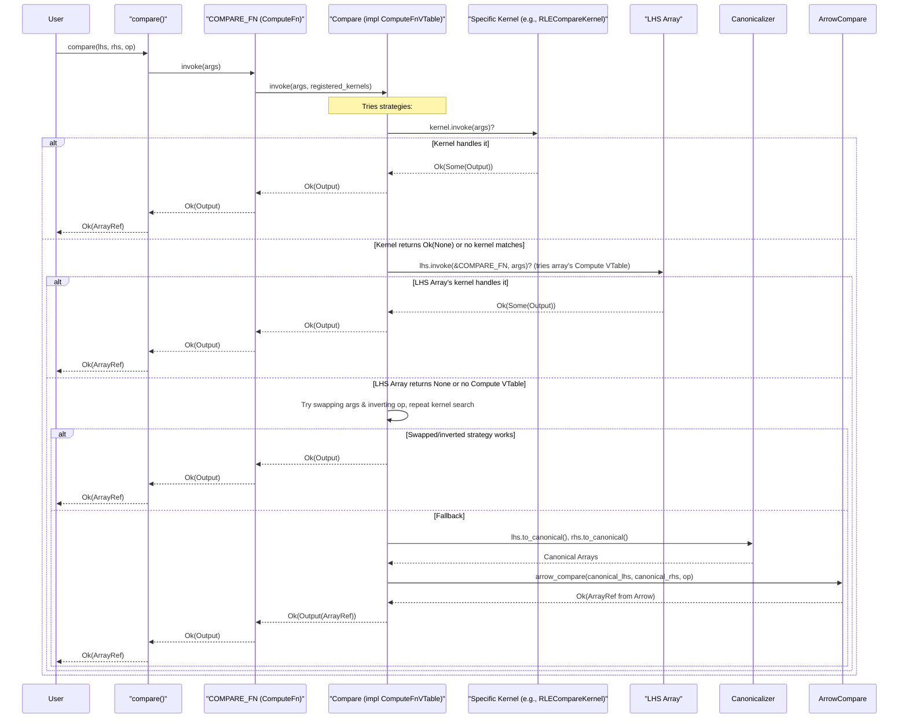

# Chapter 5: Compute Kernels (`ComputeFn`, `Kernel` trait, various specific kernel traits)

In the [previous chapter on Encoding (`EncodingRef`, `VTable` trait and macro)](04_encoding___encodingref____vtable__trait_and_macro__.md), we explored how Vortex defines the physical representation of data and uses VTables to implement encoding-specific logic for basic array operations. While VTables provide methods like `scalar_at` and `slice`, complex data processing requires a broader set of operations, such as filtering, element-wise arithmetic, comparisons, and type casting. This chapter delves into Vortex's compute kernel system, which enables these operations to be performed efficiently, often directly on encoded (e.g., compressed) data, thereby avoiding costly decompression to a canonical format.

The core idea is to have a central mechanism, `ComputeFn`, for each type of computation (e.g., "compare", "take", "filter"). Each `ComputeFn` can discover and manage multiple specialized implementations, known as "kernels." These kernels are provided by different [Array (`ArrayRef`, `dyn Array`)](03_array___arrayref____dyn_array___.md) encodings, allowing each encoding to optimize computations for its specific data layout.

## The Motivation for Compute Kernels

Performing operations directly on encoded data is a key performance strategy in Vortex. For instance, if we want to compare all elements of a Run-Length Encoded (RLE) array to a scalar value, it's far more efficient to compare the scalar against each run's value once, rather than decompressing the entire RLE array into a primitive array and then performing element-wise comparisons. Similarly, for a dictionary-encoded array, many operations can be performed on the smaller dictionary and then mapped back via codes.

Compute kernels provide the framework for these specialized implementations. Without them, most operations would require converting arrays to a [Canonical Encodings (`Canonical`)](06_canonical_encodings___canonical___.md) form first, potentially negating the benefits of using compressed encodings.

## `ComputeFn`: The Central Dispatcher

At the heart of Vortex's computation system is the `ComputeFn` struct, defined in `vortex-array/src/compute/mod.rs`. A `ComputeFn` represents a specific high-level compute operation, like "compare," "add," or "filter." It acts as a dispatcher, managing a collection of registered kernel implementations for that operation and selecting the most appropriate one at runtime based on the input array types.

```rust
// Simplified from vortex-array/src/compute/mod.rs
use std::sync::RwLock;
use arcref::ArcRef;
use vortex_error::VortexResult;
// ... other imports ...

pub struct ComputeFn {
    id: ArcRef<str>, // e.g., "compare", "take"
    vtable: ArcRef<dyn ComputeFnVTable>,
    kernels: RwLock<Vec<ArcRef<dyn Kernel>>>,
}

impl ComputeFn {
    pub fn new(id: ArcRef<str>, vtable: ArcRef<dyn ComputeFnVTable>) -> Self {
        Self {
            id,
            vtable,
            kernels: Default::default(),
        }
    }

    pub fn invoke(&self, args: &InvocationArgs) -> VortexResult<Output> {
        // ... pre-condition checks ...
        let output = self
            .vtable
            .invoke(args, &self.kernels.read().unwrap())?;
        // ... post-condition checks (dtype, len) ...
        Ok(output)
    }

    pub fn register_kernel(&self, kernel: ArcRef<dyn Kernel>) {
        self.kernels.write().unwrap().push(kernel);
    }
    // ... other methods like return_dtype, return_len, is_elementwise ...
}
```
Each `ComputeFn` instance is typically a global static, often initialized with `std::sync::LazyLock`. For example, the comparison functionality is accessed via a `COMPARE_FN: LazyLock<ComputeFn>`.
The `id` field provides a string identifier for the function. The `vtable` field points to an implementation of `ComputeFnVTable`, which defines the core logic and properties of this specific compute function (like how to determine output type and orchestrate kernel calls). The `kernels` field is a thread-safe list of `ArcRef<dyn Kernel>` instances that have registered themselves as capable of performing this compute operation.

## The Generic `Kernel` Trait

A `Kernel` is a specific implementation of a compute operation, usually optimized for certain input array encodings. All kernels implement the generic `Kernel` trait:

```rust
// Simplified from vortex-array/src/compute/mod.rs
use crate::{ArrayRef, DType};
use vortex_scalar::Scalar;
use std::any::Any;
use std::fmt::Debug;

// Arguments to a compute function invocation.
#[derive(Clone)]
pub struct InvocationArgs<'a> {
    pub inputs: &'a [Input<'a>],
    pub options: &'a dyn Options, // Function-specific options
}

// Input to a compute function.
pub enum Input<'a> {
    Scalar(&'a Scalar),
    Array(&'a dyn Array),
    // ... other variants like Mask, DType, Builder ...
}

// Output from a compute function.
#[derive(Debug)]
pub enum Output {
    Scalar(Scalar),
    Array(ArrayRef),
}
// ... Output methods like dtype(), len(), unwrap_array(), unwrap_scalar() ...

// Options for a compute function invocation.
pub trait Options: 'static {
    fn as_any(&self) -> &dyn Any;
}
impl Options for () { fn as_any(&self) -> &dyn Any { self } }


pub trait Kernel: 'static + Send + Sync + Debug {
    fn invoke(&self, args: &InvocationArgs) -> VortexResult<Option<Output>>;
}
```
The `Kernel` trait has a single crucial method, `invoke`. It takes `InvocationArgs`, which bundles the input arrays/scalars and any operation-specific options (like the comparison operator for a `compare` function). It returns a `VortexResult<Option<Output>>`.
*   `Ok(Some(Output))`: The kernel successfully processed the inputs.
*   `Ok(None)`: The kernel cannot handle these specific inputs (e.g., wrong DType, unsupported variant of the operation), and the `ComputeFn` should try another kernel or a fallback.
*   `Err(VortexError)`: An error occurred during computation.

The `Output` enum can be either an `ArrayRef` or a `Scalar`, depending on what the compute function produces. The `Options` trait allows passing function-specific parameters in a type-safe manner, typically by downcasting the `&dyn Any` to a concrete options struct.

## Specific Kernel Traits and Adapters

While `Kernel` provides a generic interface, specific compute operations usually define their own more specialized traits. For example, the compare operation has a `CompareKernel` trait:

```rust
// Simplified from vortex-array/src/compute/compare.rs
use crate::vtable::VTable;
use crate::{ArrayRef, Array};
use vortex_error::VortexResult;

#[derive(Copy, Clone, Debug, Eq, PartialEq)] // Simplified
pub enum Operator { Eq, NotEq, Gt, Gte, Lt, Lte }

// VTable is the VTable marker for an encoding (e.g., PrimitiveVTable)
pub trait CompareKernel: VTable { // Implemented by the encoding's VTable marker
    fn compare(
        &self, // The VTable marker instance
        lhs: &Self::Array, // Concrete array type for this encoding
        rhs: &dyn Array,   // Other array can be any encoding
        operator: Operator,
    ) -> VortexResult<Option<ArrayRef>>;
}
```
An encoding that wants to provide a custom comparison implementation (e.g., `MyEncoding`) would have its VTable marker (`MyVTable`) implement `CompareKernel`. The `compare` method takes the concrete array type `MyVTable::Array` (which is `MyArray`) for `lhs`, allowing direct access to its internal structure.

To bridge the gap between a specific kernel trait like `CompareKernel` and the generic `Kernel` trait expected by `ComputeFn`, adapter structs are used.

```rust
// Simplified from vortex-array/src/compute/compare.rs
use crate::compute::{Kernel, InvocationArgs, Output, Options};
// ... other imports ...

#[derive(Debug)]
pub struct CompareKernelAdapter<V: VTable + CompareKernel>(pub V); // V is the VTable marker

impl<V: VTable + CompareKernel> Kernel for CompareKernelAdapter<V> {
    fn invoke(&self, args: &InvocationArgs) -> VortexResult<Option<Output>> {
        // 1. Parse InvocationArgs into CompareArgs (lhs, rhs, operator)
        let cmp_args = CompareArgs::try_from(args)?;

        // 2. Check if lhs is of the concrete type V::Array
        let Some(lhs_concrete) = cmp_args.lhs.as_opt::<V>() else {
            return Ok(None); // This kernel is not for this lhs array type
        };

        // 3. Call the specific CompareKernel::compare method
        // self.0 is the VTable marker instance (e.g. PrimitiveVTable)
        let result_array_opt = V::compare(
            &self.0,
            lhs_concrete,
            cmp_args.rhs,
            cmp_args.operator,
        )?;
        Ok(result_array_opt.map(|arr| arr.into())) // Convert ArrayRef to Output
    }
}
```
The `CompareKernelAdapter<V>` wraps an instance of the VTable marker `V` (which implements `CompareKernel`). Its `invoke` method:
1.  Parses the generic `InvocationArgs` into strongly-typed arguments for comparison (`CompareArgs`, which extracts `lhs`, `rhs`, and `Operator`).
2.  Attempts to downcast the `lhs` `dyn Array` to the concrete array type `V::Array` associated with the VTable `V`. If this fails, the kernel isn't applicable, so it returns `Ok(None)`.
3.  If successful, it calls the `V::compare` method (the actual specialized implementation).
4.  Wraps the resulting `ArrayRef` (if any) into an `Output`.

This adapter pattern is common for all specific kernel types (`TakeKernelAdapter`, `FilterKernelAdapter`, etc.).

## Kernel Registration and Discovery

Kernels need to be registered with the appropriate `ComputeFn` to be discoverable. Vortex uses the `inventory` crate for this. An encoding can register its kernel implementation (via the adapter) using `inventory::submit!`.

```rust
// In an encoding's implementation (e.g., for a hypothetical MyEncoding)
// Assume MyVTable implements CompareKernel

// static MY_COMPARE_KERNEL_ADAPTER: CompareKernelAdapter<MyVTable> =
// CompareKernelAdapter(MyVTable);

// inventory::submit!(&MY_COMPARE_KERNEL_ADAPTER as &'static dyn Kernel);
// This is often done via a helper like:
// pub const fn lift(&'static self) -> CompareKernelRef {
// CompareKernelRef(ArcRef::new_ref(self))
// }
// And then inventory::collect!(CompareKernelRef);
```
The `ComputeFn` then uses `inventory::iter` at initialization to populate its `kernels` list. For example, `COMPARE_FN` (defined as a `LazyLock<ComputeFn>`) collects all submitted `CompareKernelRef`s.

```rust
// Simplified from vortex-array/src/compute/compare.rs
pub struct CompareKernelRef(ArcRef<dyn Kernel>);
inventory::collect!(CompareKernelRef); // All CompareKernelRefs are collected here

pub static COMPARE_FN: LazyLock<ComputeFn> = LazyLock::new(|| {
    // Creates a new ComputeFn for "compare"
    let compute = ComputeFn::new("compare".into(), ArcRef::new_ref(&Compare));
    // Registers all discovered kernels
    for kernel_ref in inventory::iter::<CompareKernelRef> {
        compute.register_kernel(kernel_ref.0.clone());
    }
    compute
});
```

## The `ComputeFnVTable` and Invocation Flow

Each `ComputeFn` has a `vtable: ArcRef<dyn ComputeFnVTable>`. This `ComputeFnVTable` trait defines the core, generic logic for that particular compute function.

```rust
// Simplified from vortex-array/src/compute/mod.rs
pub trait ComputeFnVTable: 'static + Send + Sync {
    fn invoke(
        &self,
        args: &InvocationArgs,
        kernels: &[ArcRef<dyn Kernel>], // List of registered kernels
    ) -> VortexResult<Output>;

    fn return_dtype(&self, args: &InvocationArgs) -> VortexResult<DType>;
    fn return_len(&self, args: &InvocationArgs) -> VortexResult<usize>;
    fn is_elementwise(&self) -> bool;
}
```
The `ComputeFnVTable::invoke` method is the main entry point for a computation. It receives the `InvocationArgs` and the list of registered `Kernel`s. Its responsibility is to orchestrate the execution, typically by:
1.  Performing initial checks (e.g., argument count, type compatibility).
2.  Potentially short-circuiting based on statistics (e.g., if comparing an array where all values are known to be less than a scalar).
3.  Iterating through the provided `kernels`, calling `kernel.invoke()`. If a kernel returns `Ok(Some(output))`, that result is used.
4.  If no registered kernel handles the inputs, it might try array-specific dispatch. An [Array (`ArrayRef`, `dyn Array`)](03_array___arrayref____dyn_array___.md) can have a `ComputeVTable` as part of its [Encoding (`EncodingRef`, `VTable` trait and macro)](04_encoding___encodingref____vtable__trait_and_macro__.md)'s VTable, allowing it to provide its own kernels. The `ComputeFnVTable` can call `array.invoke(&COMPARE_FN, args)` to try this path.
5.  It might try reordering arguments or inverting operations if applicable (e.g., for `compare`, `a < b` is `b > a`).
6.  As a final fallback, it typically converts input arrays to their [Canonical Encodings (`Canonical`)](06_canonical_encodings___canonical___.md) form and uses a default implementation, often leveraging Apache Arrow's compute capabilities.

Let's trace a call to `vortex_array::compute::compare::compare(lhs, rhs, op)`:



The `compare` function in `vortex-array/src/compute/compare.rs` demonstrates this rich fallback logic within its `ComputeFnVTable` implementation for `struct Compare`. It tries registered kernels, then `lhs.invoke(...)`, then `rhs.invoke(...)` with swapped arguments and operator, and finally `arrow_compare` on canonicalized inputs.

## Helper Argument Structs

Parsing `InvocationArgs` directly can be verbose. Compute functions often define helper structs to facilitate this. For `compare`:
```rust
// From vortex-array/src/compute/compare.rs
struct CompareArgs<'a> {
    lhs: &'a dyn Array,
    rhs: &'a dyn Array,
    operator: Operator,
}

impl<'a> TryFrom<&InvocationArgs<'a>> for CompareArgs<'a> {
    type Error = VortexError;
    fn try_from(value: &InvocationArgs<'a>) -> Result<Self, Self::Error> {
        // ... checks input count ...
        let lhs = value.inputs[0].array().ok_or_else(/* error */)?;
        let rhs = value.inputs[1].array().ok_or_else(/* error */)?;
        let operator = *value
            .options
            .as_any()
            .downcast_ref::<Operator>()
            .expect("Expected options to be an operator");
        Ok(CompareArgs { lhs, rhs, operator })
    }
}
```
This allows kernels to easily get typed arguments: `let cmp_args = CompareArgs::try_from(args)?;`. Similar helpers like `UnaryArgs` and `BinaryArgs` exist for common function signatures.

## Relationship with an Encoding's `ComputeVTable`

As mentioned, an [Array (`ArrayRef`, `dyn Array`)](03_array___arrayref____dyn_array___.md) can provide its own kernel implementations through its [Encoding (`EncodingRef`, `VTable` trait and macro)](04_encoding___encodingref____vtable__trait_and_macro__.md)'s VTable system. The main `VTable` trait (which an encoding's marker type like `PrimitiveVTable` implements) can specify a `ComputeVTable` associated type.

```rust
// Conceptual part of an encoding's VTable implementation
// pub trait EncodingComputeVTable<V: VTable>: Send + Sync {
//    fn compare(&self, array: &V::Array, rhs: &dyn Array, op: Operator)
// -> VortexResult<Option<ArrayRef>>;
//    // ... other compute methods ...
// }
//
// impl VTable for MyEncodingVTable {
//    type ComputeVTable = MyEncodingComputeVTableImpl; // Struct that implements EncodingComputeVTable
//    // ... other VTable associated types ...
// }
```
When `array.invoke(&COMPARE_FN, args)` is called, it effectively tries to find if `MyEncodingComputeVTableImpl` has a specialized `compare` method. This provides another avenue for encodings to plug in their compute logic, complementing the global kernel registration.

## Extending with New Compute Kernels

To add a new compute kernel for an existing encoding (e.g., `MyExistingEncoding`) for an existing operation (e.g., `compare`):
1.  Ensure `MyExistingEncodingVTable` implements `CompareKernel`.
    ```rust
    // In my_existing_encoding/compare.rs (or similar)
    // impl CompareKernel for MyExistingEncodingVTable {
    //     fn compare(&self, lhs: &MyExistingArray, ...) -> Result<Option<ArrayRef>> {
    //         // ... specialized logic for MyExistingArray ...
    //     }
    // }
    ```
2.  Create a static instance of the adapter and register it.
    ```rust
    // In my_existing_encoding/mod.rs or a dedicated compute_kernels.rs
    // use vortex_array::compute::compare::{CompareKernelAdapter, CompareKernelRef};
    //
    // pub static MY_EXISTING_COMPARE_ADAPTER: CompareKernelAdapter<MyExistingEncodingVTable> =
    //     CompareKernelAdapter(MyExistingEncodingVTable);
    //
    // inventory::submit!(CompareKernelRef(ArcRef::new_ref(&MY_EXISTING_COMPARE_ADAPTER)));
    ```
    Alternatively, many Vortex encodings provide a `const fn lift()` on their adapter to create the `...KernelRef` which can then be collected by `inventory::collect!`.

If you are defining a completely new compute operation (e.g., "find_pattern"):
1.  Define `FindPatternOptions`, `FindPatternKernel` trait, and `FindPatternKernelAdapter`.
2.  Create a `struct FindPattern;` and implement `ComputeFnVTable` for it, defining its orchestration logic.
3.  Initialize a global `FIND_PATTERN_FN: LazyLock<ComputeFn>` that collects `FindPatternKernelRef`s.
4.  Encodings can then implement `FindPatternKernel` and register their adapters.

## List of Common Compute Functions

Vortex aims to support a variety of common compute functions. As listed in `docs/concepts/compute.md`, these include:
*   Binary boolean operations (`and`, `or`).
*   Binary numeric operations (`add`, `sub`, `mul`, `div`).
*   Comparisons (`eq`, `neq`, `gt`, `lt`, etc.).
*   Casting (`try_cast`).
*   Filling nulls (`fill_forward`, `fill_null`).
*   Boolean inversion (`invert_fn`).
*   String matching (`like`).
*   Element access (`scalar_at` - also part of `Array` trait, but compute path can optimize).
*   Searching in sorted arrays (`search_sorted`).
*   Slicing (`slice` - also part of `Array` trait).
*   Taking elements by indices (`take`).
*   Filtering by a boolean mask (`filter`).

Each of_these would typically have its own `ComputeFn` instance and associated specific kernel trait.

## Conclusion

Vortex's compute kernel system, centered around `ComputeFn` and the `Kernel` trait (along with its specific variants like `CompareKernel`), provides a powerful and extensible mechanism for performing operations on arrays. It allows specialized implementations for different encodings, enabling computations to occur directly on compressed or otherwise optimized data formats. This significantly boosts performance by avoiding unnecessary decompression. The system's use of dynamic registration via `inventory` and a layered fallback strategy (including delegation to array-specific VTables and finally to canonical/Arrow implementations) ensures both flexibility and correctness.

Having explored how Vortex represents data and performs computations on it, we next turn to a crucial set of encodings: the [Canonical Encodings (`Canonical`)](06_canonical_encodings___canonical___.md). These serve as the standard, uncompressed representations to which other encodings can be converted when direct computation is not feasible or when interoperability is required.

---

Generated by [AI Codebase Knowledge Builder](https://github.com/The-Pocket/Tutorial-Codebase-Knowledge)
