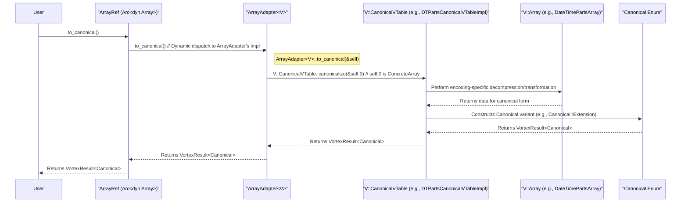

# Chapter 6: Canonical Encodings (`Canonical`)

In the [previous chapter on Compute Kernels (`ComputeFn`, `Kernel` trait, various specific kernel traits)](05_compute_kernels___computefn____kernel__trait__various_specific_kernel_traits__.md), we explored how Vortex performs operations, often directly on encoded data. However, not every operation can be efficiently implemented for every encoding, and sometimes, data needs to be exchanged with other systems like Apache Arrow. This chapter introduces Canonical Encodings, represented by the `Canonical` enum, which serve as the standard, uncompressed in-memory representations for each [DType (`DType`)](01_dtype___dtype___.md). They provide a common ground for computation and are designed for zero-copy interoperability.

## The Need for a Standard Form

Vortex's strength lies in its ability to work with diverse data encodings, optimizing for storage space and computational efficiency. However, this diversity necessitates a common, standardized format for several reasons:

1.  **Fallback for Computations**: If a specific [Compute Kernels (`ComputeFn`, `Kernel` trait, various specific kernel traits)](05_compute_kernels___computefn____kernel__trait__various_specific_kernel_traits__.md) is not available or optimized for a particular [Encoding (`EncodingRef`, `VTable` trait and macro)](04_encoding___encodingref____vtable__trait_and_macro__.md), the input [Array (`ArrayRef`, `dyn Array`)](03_array___arrayref____dyn_array___.md) can be converted (decompressed) to its canonical form. Operations can then proceed on this standard, uncompressed representation, often leveraging libraries like Apache Arrow's compute kernels.
2.  **Interoperability**: To exchange data with other systems, especially Apache Arrow, a well-defined, compatible memory layout is essential. Canonical encodings in Vortex are designed to map directly to Arrow's array formats, enabling zero-copy or near-zero-copy data exchange.
3.  **Simplified Development**: When developing new functionalities or encodings, having a standard target for decompression simplifies testing and ensures a baseline level of functionality.

Canonical encodings are, therefore, the uncompressed, standard in-memory representation for each logical [DType (`DType`)](01_dtype___dtype___.md). Every Vortex encoding must support conversion to its canonical form.

## The `Canonical` Enum

The `Canonical` enum, defined in `vortex-array/src/canonical.rs`, serves as a wrapper for the various concrete array types that represent these standard forms. Each variant of the `Canonical` enum corresponds to a specific canonical array structure.

```rust
// Simplified from vortex-array/src/canonical.rs
use crate::arrays::{
    BoolArray, DecimalArray, ExtensionArray, ListArray, NullArray, PrimitiveArray, StructArray,
    VarBinViewArray,
};

#[derive(Debug, Clone)]
pub enum Canonical {
    Null(NullArray),
    Bool(BoolArray),
    Primitive(PrimitiveArray),
    Decimal(DecimalArray),
    Struct(StructArray),
    List(ListArray),
    VarBinView(VarBinViewArray), // For Utf8 and Binary DTypes
    Extension(ExtensionArray),
}
```
This enum clearly lists the array types considered canonical for their respective logical data types. For instance:
*   `Canonical::Primitive(PrimitiveArray)` wraps a `PrimitiveArray`, which is the standard representation for primitive [DType (`DType`)](01_dtype___dtype___.md)s like `I32`, `F64`, etc.
*   `Canonical::VarBinView(VarBinViewArray)` wraps a `VarBinViewArray`, serving as the canonical form for `DType::Utf8` and `DType::Binary`. This choice aligns with modern Arrow representations for variable-length binary data, offering performance benefits.
*   `Canonical::Extension(ExtensionArray)` is used for extension types. The `ExtensionArray` itself stores its data using another underlying array, which must also eventually resolve to a canonical form (e.g., an extension `TimestampNs` might be stored as a `PrimitiveArray` of `I64`).

## Conversion to Canonical Form: `Array::to_canonical()`

The primary mechanism for converting any Vortex [Array (`ArrayRef`, `dyn Array`)](03_array___arrayref____dyn_array___.md) to its canonical representation is the `to_canonical()` method, which is part of the `Array` trait.

```rust
// Part of the Array trait definition
// pub trait Array {
//     // ... other methods ...
//     fn to_canonical(&self) -> VortexResult<Canonical>;
// }
```
Calling `array_ref.to_canonical()` on any `ArrayRef` will produce a `Canonical` enum instance containing the data in its standard, uncompressed form. This operation might involve significant computation and memory allocation if the original array is heavily compressed or uses a complex encoding.

### The Role of `CanonicalVTable`

The actual logic for converting a specific encoding to its canonical form is implemented within that encoding's [Encoding (`EncodingRef`, `VTable` trait and macro)](04_encoding___encodingref____vtable__trait_and_macro__.md) structure, specifically through the `CanonicalVTable` part of its VTable.

The `CanonicalVTable` trait (from `vortex-array/src/vtable/decode.rs`, though `decode` might be renamed to `canonical` or similar) defines a `canonicalize` method:
```rust
// Simplified from vortex-array/src/vtable/decode.rs
use vortex_error::VortexResult;
use crate::Canonical;
use crate::vtable::VTable; // The VTable marker for an encoding

pub trait CanonicalVTable<MyVTable: VTable> { // MyVTable is the specific encoding's VTable marker
    fn canonicalize(array: &MyVTable::Array) -> VortexResult<Canonical>;
    // ... other methods like append_to_builder ...
}
```
Each encoding (e.g., RLE, Dictionary, or a custom encoding like `DateTimePartsArray`) provides an implementation of `CanonicalVTable::canonicalize` for its specific array type. This function performs the decompression or transformation.

### Example: Canonicalizing `DateTimePartsArray`

Let's consider the `DateTimePartsArray` from the `encodings/datetime-parts` crate. This array stores temporal data as separate components (days, seconds, subseconds) and is an extension type. Its canonical form involves converting these parts into a single series of timestamp values, typically stored in a `PrimitiveArray` of `I64`, wrapped within a `TemporalArray` (which itself is an `ExtensionArray`).

The `CanonicalVTable` implementation for `DateTimePartsVTable` looks like this:
```rust
// From encodings/datetime-parts/src/canonical.rs
use vortex_array::{Canonical, IntoArray}; // IntoArray for .into() on TemporalArray
use vortex_array::vtable::CanonicalVTable;
use vortex_error::VortexResult;

use crate::{DateTimePartsArray, DateTimePartsVTable};
// Import the actual decoding logic function
use crate::canonical::decode_to_temporal;

impl CanonicalVTable<DateTimePartsVTable> for DateTimePartsVTable {
    fn canonicalize(array: &DateTimePartsArray) -> VortexResult<Canonical> {
        // decode_to_temporal reconstructs the timestamp values
        let temporal_array = decode_to_temporal(array)?;
        // The TemporalArray (an ExtensionArray) is wrapped in Canonical::Extension
        Ok(Canonical::Extension(temporal_array.into_array().into()))
    }
}
```
The `decode_to_temporal` function (also in `encodings/datetime-parts/src/canonical.rs`) performs the heavy lifting. Here's a conceptual outline of its logic:

1.  **Metadata Extraction**: It retrieves `TemporalMetadata` (like `TimeUnit` and `TimeZone`) from the `DateTimePartsArray`'s [DType (`DType`)](01_dtype___dtype___.md).
2.  **Component Retrieval and Casting**: It accesses the child arrays for `days`, `seconds`, and `subseconds`. These children might themselves be in various encodings, so they are cast to primitive types (e.g., `I64` for days, `U32` for seconds).
    ```rust
    // Simplified from encodings/datetime-parts/src/canonical.rs
    // let days_buf = cast(
    //     array.days(),
    //     &DType::Primitive(PType::I64, array.dtype().nullability()),
    // )?
    // .to_primitive()?;
    ```
    The `cast` function is a [Compute Kernels (`ComputeFn`, `Kernel` trait, various specific kernel traits)](05_compute_kernels___computefn____kernel__trait__various_specific_kernel_traits__.md) that converts the `days` array (which could be any encoding) into a canonical `PrimitiveArray`.
3.  **Value Reconstruction**: It iterates through the components, combining them into a single timestamp value according to the `TimeUnit`. For example, days are multiplied by `86_400 * divisor`, seconds by `divisor`, etc., where `divisor` adapts the component to the target `TimeUnit` (e.g., `1_000_000_000` for nanoseconds).
    ```rust
    // Conceptual:
    // let mut values: BufferMut<i64> = days_buf.map_each(|d| d * 86_400 * divisor);
    // for (v, second) in values.iter_mut().zip(seconds_array.iter()) {
    //     *v += (*second as i64) * divisor;
    // }
    // ... and for subseconds ...
    ```
4.  **Result Assembly**: The reconstructed timestamp values (now a buffer of `i64`) and the original array's validity information are used to create a new `PrimitiveArray`. This `PrimitiveArray` is then wrapped in a `TemporalArray` (an `ExtensionArray` that holds the `TemporalMetadata`).
    ```rust
    // Simplified from encodings/datetime-parts/src/canonical.rs
    // Ok(TemporalArray::new_timestamp(
    //     PrimitiveArray::new(values.freeze(), validity_data).into_array(),
    //     temporal_metadata.time_unit(),
    //     temporal_metadata.time_zone(),
    // ))
    ```
This `TemporalArray` is then returned wrapped in `Canonical::Extension`. This example illustrates that canonicalization can be a complex, multi-step process involving computation and conversion of child arrays.

### The `ToCanonical` Trait

For convenience, Vortex provides the `ToCanonical` trait (in `vortex-array/src/canonical.rs`). This trait offers helper methods like `to_primitive()`, `to_bool()`, etc., which first call `self.to_canonical()` and then attempt to unwrap the specific canonical array type.
```rust
// From vortex-array/src/canonical.rs
pub trait ToCanonical: Array {
    fn to_primitive(&self) -> VortexResult<PrimitiveArray> {
        self.to_canonical()?.into_primitive()
    }
    // ... other similar helpers like to_bool(), to_struct() ...
}

// Blanket implementation for all types implementing Array
impl<A: Array + ?Sized> ToCanonical for A {}
```
This allows users to directly request a specific canonical type if known, e.g., `my_array_ref.to_primitive()`.

## Working with `Canonical` Instances

Once you have a `Canonical` enum instance, you can:

1.  **Access the underlying concrete array**: Using methods like `into_primitive()`, `into_bool()`, `into_varbinview()`, etc. These are defined on the `Canonical` enum itself.
    ```rust
    use vortex_array::{Canonical, Array, PrimitiveArray, DType, PType, Nullability};
    use vortex_error::VortexResult;

    fn process_canonical(canonical_array: Canonical) -> VortexResult<()> {
        if canonical_array.as_ref().dtype().is_primitive() {
            let primitive_arr: PrimitiveArray = canonical_array.into_primitive()?;
            println!("Got primitive array with length: {}", primitive_arr.len());
        // Process primitive_arr
        }
        Ok(())
    }
    ```
    Each `into_X` method returns `VortexResult<XArray>` because the `Canonical` instance might be a different variant than expected.

2.  **Treat it as a generic `ArrayRef`**: The `Canonical` enum implements `IntoArray` and `AsRef<dyn Array>`, allowing it to be used wherever an `ArrayRef` is expected.
    ```rust
    use vortex_array::{Canonical, ArrayRef, IntoArray, Array};

    let canonical_primitive: Canonical = // ... obtain a Canonical::Primitive
        # Canonical::empty(&DType::Primitive(PType::I32, Nullability::NonNullable));
    let array_ref: ArrayRef = canonical_primitive.into_array(); // Consumes Canonical
    // Or, to get a reference:
    // let array_dyn_ref: &dyn Array = canonical_primitive.as_ref();
    println!("Array DType: {}", array_ref.dtype());
    ```

3.  **Create empty canonical arrays**: The `Canonical::empty(dtype: &DType)` static method provides a way to create an empty array of the appropriate canonical type for a given [DType (`DType`)](01_dtype___dtype___.md).
    ```rust
    use vortex_array::Canonical;
    use vortex_dtype::{DType, PType, Nullability};

    let empty_bool_canonical = Canonical::empty(&DType::Bool(Nullability::Nullable));
    // empty_bool_canonical is now Canonical::Bool(BoolArray::new_empty(...))
    println!("Empty canonical type: {:?}", empty_bool_canonical.as_ref().dtype());
    ```
    Output:
    ```
    Empty canonical type: bool?
    ```

## Internal Invocation of `to_canonical()`

When `array_ref.to_canonical()` is invoked, the call is dispatched through the array's VTable mechanism to the encoding-specific implementation.


The `ArrayAdapter<V>`'s `to_canonical` method simply delegates the call:
```rust
// Conceptual implementation in ArrayAdapter<V: VTable>
// fn to_canonical(&self) -> VortexResult<Canonical> {
//     // self.0 is the concrete array instance, e.g., DateTimePartsArray
//     <V::CanonicalVTable as CanonicalVTable<V>>::canonicalize(&self.0)
// }
```
This ensures that the correct `canonicalize` function, tailored to the specific encoding `V` of the array, is executed.

## Zero-Copy Interoperability with Apache Arrow

A primary design goal for canonical encodings is to facilitate efficient data exchange with Apache Arrow, ideally with zero memory copies. Vortex's canonical array types are structured to align closely with Arrow's in-memory formats:

*   `vortex_array::PrimitiveArray` maps to `arrow_array::PrimitiveArray`.
*   `vortex_array::BoolArray` maps to `arrow_array::BooleanArray`.
*   `vortex_array::StructArray` maps to `arrow_array::StructArray`.
*   `vortex_array::ListArray` maps to `arrow_array::ListArray` (or `LargeListArray`).
*   `vortex_array::VarBinViewArray` maps to `arrow_array::StringViewArray` (for `DType::Utf8`) or `arrow_array::BinaryViewArray` (for `DType::Binary`). The use of "views" (also known as "German strings" in some contexts) for variable-length binary data is a modern Arrow feature that avoids large offset buffers and can improve cache performance.
*   `vortex_array::DecimalArray` maps to `arrow_array::Decimal128Array` or `Decimal256Array`.
*   `vortex_array::NullArray` maps to `arrow_array::NullArray`.
*   `vortex_array::ExtensionArray` maps to Arrow's extension types, where the underlying storage array in Vortex would also map to a corresponding Arrow storage array.

This alignment allows for the implementation of `FromArrowArray` and `IntoArrowArray` traits (typically in a crate like `vortex-arrow`) that can convert between Vortex canonical arrays and Arrow arrays efficiently. For primitive types and fixed-width types, this conversion can often be truly zero-copy, involving only metadata adjustments. For variable-length types like strings, `VarBinViewArray` is specifically chosen for its direct compatibility with Arrow's view types.

## Table of DType to Canonical Encoding Mappings

The `docs/concepts/arrays.md` file provides a table illustrating the mapping from logical [DType (`DType`)](01_dtype___dtype___.md) to their canonical encodings. This table is crucial for understanding the standard physical representation for each logical type:

| Data Type (`DType`) | Canonical Encoding (`Canonical` variant wrapping) |
|---------------------|---------------------------------------------------|
| `DType::Null`       | `NullArray`                                       |
| `DType::Bool`       | `BoolArray`                                       |
| `DType::Primitive`  | `PrimitiveArray`                                  |
| `DType::Decimal`    | `DecimalArray`                                    |
| `DType::Utf8`       | `VarBinViewArray`                                 |
| `DType::Binary`     | `VarBinViewArray`                                 |
| `DType::Struct`     | `StructArray`                                     |
| `DType::List`       | `ListArray`                                       |
| `DType::Extension`  | `ExtensionArray` (storage is also canonical)    |

This mapping guides how arrays are represented when no specialized encoding is used or when data is prepared for export.

## Role in Compute Kernel Fallbacks

As discussed in the chapter on [Compute Kernels (`ComputeFn`, `Kernel` trait, various specific kernel traits)](05_compute_kernels___computefn____kernel__trait__various_specific_kernel_traits__.md), if a compute operation doesn't have a specialized kernel for a given array's encoding, the system can fall back to a default strategy. This often involves:
1.  Converting all input arrays to their canonical forms using `to_canonical()`.
2.  Performing the computation on these canonical arrays, potentially by converting them to Apache Arrow arrays and using Arrow's compute kernels.
3.  Converting the result (if it's an Arrow array) back to a Vortex canonical array.

Canonical encodings are thus indispensable for ensuring that all operations can be performed on all array types, even if not always with the peak performance offered by encoding-specific kernels.

## Conclusion

Canonical Encodings, represented by the `Canonical` enum, are the bedrock of Vortex's data representation strategy. They provide a standard, uncompressed format for every logical [DType (`DType`)](01_dtype___dtype___.md), ensuring a common ground for computations and seamless, zero-copy interoperability with Apache Arrow. The `to_canonical()` method, implemented by each encoding via its `CanonicalVTable`, allows any Vortex array to be transformed into this standard representation. This mechanism is vital for compute fallbacks and data exchange, making canonical encodings a cornerstone of the Vortex ecosystem.

With an understanding of how data is logically typed, physically encoded, computed upon, and standardized into canonical forms, we next explore how Vortex manages metadata about the data within arrays. This leads us to the concept of [Statistics (`Stat`, `StatsSet`)](07_statistics___stat____statsset___.md).

---

Generated by [AI Codebase Knowledge Builder](https://github.com/The-Pocket/Tutorial-Codebase-Knowledge)
