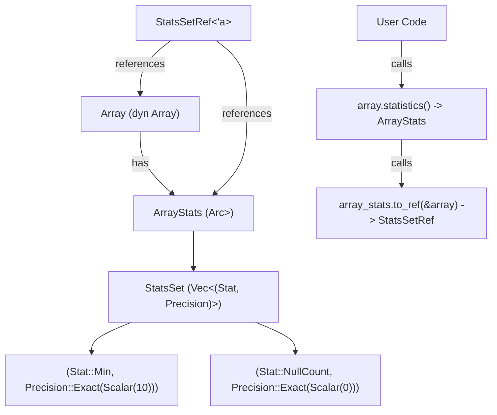
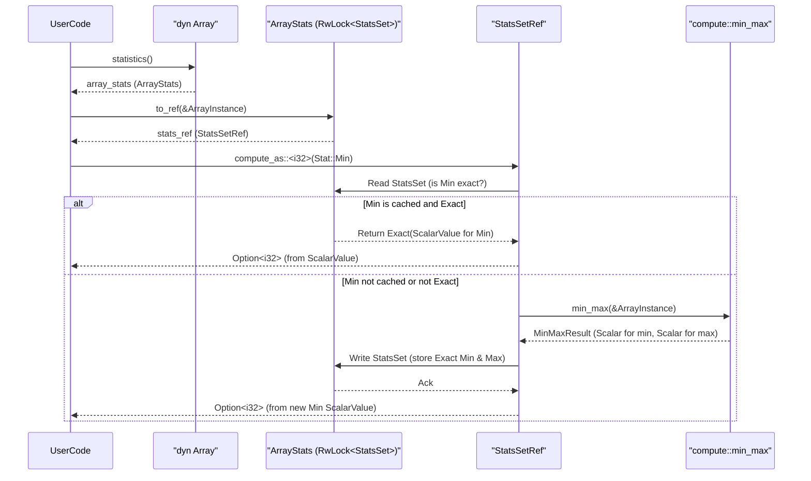

# Chapter 7: Statistics (`Stat`, `StatsSet`)

In the [previous chapter on Canonical Encodings (`Canonical`)](06_canonical_encodings___canonical___.md), we examined the standard, uncompressed representations of data in Vortex. These canonical forms are crucial for interoperability and serve as a fallback for computations. However, to achieve high performance, Vortex aims to operate on encoded data directly and avoid unnecessary decompression or even data access. This chapter introduces Statistics (`Stat`, `StatsSet`), which are metadata associated with [Array (`ArrayRef`, `dyn Array`)](03_array___arrayref____dyn_array___.md)s that capture key properties of their data. These statistics are instrumental for query optimization, enabling compute kernels and layout readers to prune data or select more efficient execution paths without needing to access the raw array data itself.

## The Motivation for Statistics

Imagine a large dataset where you need to find all rows where a particular column's value is greater than 100. If an array chunk has a pre-computed maximum value statistic of 50, that entire chunk can be skipped without reading or decompressing any of its actual data. Similarly, knowing if an array is sorted can allow for the use of more efficient search algorithms. Statistics provide this kind of summary information.

In Vortex, statistics serve several key purposes:
1.  **Data Pruning**: Query engines can use statistics like minimum/maximum values to skip reading or processing entire array chunks that cannot possibly satisfy a query predicate.
2.  **Algorithm Selection**: Properties like sortedness or constantness can inform the choice of algorithms. For example, a merge join is efficient for sorted inputs, and operations on constant arrays can often be reduced to a single scalar operation.
3.  **Resource Estimation**: Null counts or uncompressed sizes can help in estimating memory requirements or computational costs.
4.  **Lazy Computation**: Some statistics can be computed on demand and cached, deferring work until it's actually needed.

## The `Stat` Enum: Identifying Specific Statistics

The `Stat` enum, defined in `vortex-array/src/stats/mod.rs`, enumerates the different kinds of statistical properties that Vortex can track for an array.

```rust
// Simplified excerpt from vortex-array/src/stats/mod.rs
#[derive(Debug, Clone, Copy, PartialEq, Eq, /* ... */)]
#[repr(u8)]
pub enum Stat {
    IsConstant = 0,
    IsSorted = 1,
    IsStrictSorted = 2,
    Max = 3,
    Min = 4,
    Sum = 5,
    NullCount = 6,
    UncompressedSizeInBytes = 7,
    NaNCount = 8,
    // ... potentially other stats
}
```
Each variant represents a distinct piece of metadata:
*   `IsConstant`: A boolean indicating if all valid (non-null) elements in the array are identical. If all elements are null, it's also considered constant.
*   `IsSorted`: A boolean indicating if the valid (non-null) elements are in non-decreasing order.
*   `IsStrictSorted`: A boolean indicating if the valid (non-null) elements are in strictly increasing order (sorted and unique).
*   `Max`: The maximum valid (non-null) value in the array. Its [DType (`DType`)](01_dtype___dtype___.md) matches the array's element DType.
*   `Min`: The minimum valid (non-null) value in the array. Its DType matches the array's element DType.
*   `Sum`: The sum of all valid (non-null) numeric values. The DType of the sum might be wider than the element DType to prevent overflow (e.g., sum of `I32`s might be `I64`).
*   `NullCount`: An unsigned integer representing the number of null elements in the array.
*   `UncompressedSizeInBytes`: An unsigned integer indicating the size in bytes the array would occupy in its [Canonical Encodings (`Canonical`)](06_canonical_encodings___canonical___.md) form.
*   `NaNCount`: For floating-point arrays, the number of NaN (Not a Number) values.

The `Stat` enum also provides helper methods:
*   `dtype(array_dtype: &DType) -> Option<DType>`: Returns the [DType (`DType`)](01_dtype___dtype___.md) of the [Scalar (`Scalar`)](02_scalar___scalar___.md) value that would represent this statistic for an array of `array_dtype`. For example, `Stat::NullCount` has a `DType` of `U64`, while `Stat::Min` has the same `DType` as the array.
*   `is_commutative() -> bool`: Indicates if the statistic's computation is commutative, which affects how statistics from different array chunks can be merged. Min/max are commutative; sortedness is not.

Vortex defines constants like `PRUNING_STATS` (e.g., `Min`, `Max`, `NullCount`) and `STATS_TO_WRITE` to guide which statistics are prioritized for computation during compression/writing or for serialization.

## `Precision<T>`: Representing Exactness

Statistics are not always known with perfect accuracy. For instance, if we slice an array, the `Min` value of the slice is exact if the original `Min` was exact and falls within the slice. However, if we only have an approximate `Min` for the original array, the slice's `Min` will also be approximate.

The `Precision<T>` enum, found in `vortex-array/src/stats/precision.rs` (though the generic `T` is often specialized to `ScalarValue`), addresses this:
```rust
// Simplified from vortex-array/src/stats/precision.rs
#[derive(Debug, Clone, PartialEq, Eq)]
pub enum Precision<T> {
    Exact(T),
    Inexact(T), // The value T is an upper/lower bound or some other approximation
}
```
*   `Exact(T)`: The statistic `T` is known precisely.
*   `Inexact(T)`: The statistic `T` is an approximation. For `Min`, an inexact value would be a lower bound; for `Max`, an upper bound. For boolean stats like `IsSorted`, `Inexact(false)` means it might be sorted or not, but `Inexact(true)` means it is definitely sorted (though this specific case for booleans usually resolves to `Exact`).

Most statistical values are stored as [Scalar (`Scalar`)](02_scalar___scalar___.md)s. Thus, `Precision<ScalarValue>` is a common type for stored statistics, where `ScalarValue` is the underlying value part of a `Scalar`.

## `StatsSet`: A Collection of Statistics

An array typically has multiple statistics associated with it. The `StatsSet` struct, defined in `vortex-array/src/stats/stats_set.rs`, serves as a container for these.

```rust
// Simplified from vortex-array/src/stats/stats_set.rs
use vortex_scalar::ScalarValue;
use crate::stats::{Stat, Precision};

#[derive(Default, Debug, Clone)]
pub struct StatsSet {
    values: Vec<(Stat, Precision<ScalarValue>)>,
}
```
Internally, `StatsSet` holds a vector of tuples, where each tuple is a `Stat` identifier and its corresponding `Precision<ScalarValue>`.

`StatsSet` provides various methods for construction and manipulation:
*   `StatsSet::new_unchecked(values: Vec<(Stat, Precision<ScalarValue>)>)`: Creates a `StatsSet` from a vector.
*   `StatsSet::nulls(len: usize)`: Creates stats for an array known to contain only nulls. `NullCount` will be `len`, `IsConstant` true, etc.
*   `StatsSet::empty_array()`: Creates stats for an empty array.
*   `StatsSet::constant(scalar: Scalar, length: usize)`: Creates stats for an array known to be constant.
*   `set(stat: Stat, value: Precision<ScalarValue>)`: Adds or updates a statistic.
*   `get(stat: Stat) -> Option<Precision<ScalarValue>>`: Retrieves a statistic.
*   `clear(stat: Stat)`: Removes a statistic.
*   `iter()`: Returns an iterator over the stored statistics.

`StatsSet` also implements the `StatsProvider` trait, which standardizes access to statistics.

```rust
// From vortex-array/src/stats/traits.rs
use vortex_scalar::ScalarValue;
use crate::stats::{Precision, Stat};

pub trait StatsProvider {
    fn get(&self, stat: Stat) -> Option<Precision<ScalarValue>>;
    fn len(&self) -> usize; // Number of stats available
    // ... other helper methods provided via StatsProviderExt ...
}
```
The `StatsProviderExt` trait provides convenience methods like `get_as<U>(stat: Stat)` to retrieve a statistic and attempt to convert its `ScalarValue` to a specific Rust type `U`.

## `ArrayStats` and `StatsSetRef`: Statistics in Arrays

An [Array (`ArrayRef`, `dyn Array`)](03_array___arrayref____dyn_array___.md) carries its statistics using the `ArrayStats` struct, defined in `vortex-array/src/stats/array.rs`.

```rust
// Simplified from vortex-array/src/stats/array.rs
use std::sync::Arc;
use parking_lot::RwLock;
use crate::stats::StatsSet;
use crate::Array; // The main Array trait

#[derive(Clone, Default, Debug)]
pub struct ArrayStats {
    inner: Arc<RwLock<StatsSet>>,
}
```
`ArrayStats` wraps a `StatsSet` within an `Arc<RwLock<...>>`. This allows:
*   **Shared Ownership**: Multiple `ArrayRef`s pointing to the same underlying array data (e.g., after cloning an `ArrayRef` or slicing) can share the same `ArrayStats` instance.
*   **Mutable Access**: Statistics can be computed lazily and updated in place, even if the `ArrayRef` itself is immutable from the user's perspective. The `RwLock` ensures thread-safe access.

While `ArrayStats` holds the persistent statistics, direct interaction for computation or modification often happens through a temporary `StatsSetRef<'a>`:

```rust
// Simplified from vortex-array/src/stats/array.rs
pub struct StatsSetRef<'a> {
    dyn_array_ref: &'a dyn Array, // A reference to the array itself
    parent_stats: ArrayStats,     // The ArrayStats instance to update
}

impl ArrayStats {
    pub fn to_ref<'a>(&self, array: &'a dyn Array) -> StatsSetRef<'a> {
        StatsSetRef {
            dyn_array_ref: array,
            parent_stats: self.clone(),
        }
    }
}
```
When you call `array.statistics()`, you get an `ArrayStats` instance. You can then call `array_stats.to_ref(&array_instance)` to get a `StatsSetRef`. This `StatsSetRef` is crucial because it links the statistics store (`parent_stats`) with the actual array data (`dyn_array_ref`), enabling on-demand computation of statistics.



## Computing Statistics with `StatsSetRef`

The `StatsSetRef` provides the `compute_stat(stat: Stat)` method for calculating a statistic if it's not already present and exact.

```rust
// In StatsSetRef<'a> from vortex-array/src/stats/array.rs
// pub fn compute_stat(&self, stat: Stat) -> VortexResult<Option<ScalarValue>> {
//     // 1. If exact stat already in self.parent_stats, return it.
//     if let Some(Precision::Exact(val)) = self.get(stat) { // get() from StatsProvider
//         return Ok(Some(val));
//     }

//     // 2. Compute the statistic using the self.dyn_array_ref
//     let computed_value: Option<ScalarValue> = match stat {
//         Stat::Min => {
//             // Calls vortex_array::compute::min_max(self.dyn_array_ref)?
//             // Extracts min from result.
//             // Simplified:
//             let min_max_res = min_max(self.dyn_array_ref)?;
//             min_max_res.map(|res| res.min.into_value())
//         }
//         Stat::NullCount => Some(self.dyn_array_ref.invalid_count()?.into()),
//         Stat::IsSorted => Some(is_sorted(self.dyn_array_ref)?.into()),
//         // ... other cases for other stats ...
//         Stat::UncompressedSizeInBytes => {
//             let nbytes = self.dyn_array_ref.to_canonical()?.as_ref().nbytes() as u64;
//             Some(nbytes.into())
//         }
//         _ => unimplemented!("Computation for other stats"),
//     };

//     // 3. If computed, store it back as Exact into self.parent_stats
//     if let Some(ref val) = computed_value {
//         self.set(stat, Precision::Exact(val.clone())); // set() updates parent_stats
//     }
//     Ok(computed_value)
// }
```
When `compute_stat` is called:
1.  It first checks if the `StatsSet` (via `self.parent_stats.inner.read()`) already contains an `Exact` value for the requested `Stat`. If so, it's returned.
2.  If not, it computes the statistic using the `self.dyn_array_ref`. This typically involves calling functions from `vortex_array::compute` (which are [Compute Kernels (`ComputeFn`, `Kernel` trait, various specific kernel traits)](05_compute_kernels___computefn____kernel__trait__various_specific_kernel_traits__.md)), such as `min_max()`, `sum()`, `is_sorted()`. For `Stat::UncompressedSizeInBytes`, it involves converting the array to its [Canonical Encodings (`Canonical`)](06_canonical_encodings___canonical___.md) form.
3.  The newly computed value is then stored back into the `parent_stats` (via `self.parent_stats.inner.write()`) with `Precision::Exact`.
4.  The computed value (or `None` if not applicable/computable) is returned.

This lazy computation strategy ensures that statistics are only calculated when needed, and subsequent requests for the same exact statistic can be served quickly from the cache.

A typical usage pattern:
```rust
use vortex_array::{Array, StatsProviderExt}; // For get_as
use vortex_array::stats::Stat;
use vortex_error::VortexResult;

fn get_min_value(array: &dyn Array) -> VortexResult<Option<i32>> {
    // 1. Get ArrayStats from the array.
    let array_stats: &vortex_array::stats::ArrayStats = array.statistics();
    // 2. Get StatsSetRef by providing the array instance.
    let stats_ref: vortex_array::stats::StatsSetRef<'_> = array_stats.to_ref(array);
    // 3. Compute (or get cached) Stat::Min and try to convert to i32.
    let min_val: Option<i32> = stats_ref.compute_as(Stat::Min);
    Ok(min_val)
}
```
The `compute_as::<U>(Stat)` helper (from `StatsProviderExt`) calls `compute_stat` and then attempts to convert the resulting `ScalarValue` to type `U`.

Here's a sequence diagram illustrating the process of fetching `Stat::Min`:


## Merging Statistics

When combining data from multiple arrays (e.g., concatenating them), their statistics also need to be merged. `StatsSet` provides methods for this:
*   `merge_ordered(other: &Self, dtype: &DType)`: Merges statistics from `other` into `self`, assuming `other` represents data appended after `self`. This is important for non-commutative stats like `IsSorted`.
*   `merge_unordered(other: &Self, dtype: &DType)`: Merges statistics assuming no order between `self` and `other`. Non-commutative statistics are typically dropped or become inexact.

Let's consider `merge_ordered` for a few key stats:
*   **`Stat::Min`**: The new minimum is `min(self.Min, other.Min)`.
*   **`Stat::Max`**: The new maximum is `max(self.Max, other.Max)`.
*   **`Stat::NullCount`**: The new null count is `self.NullCount + other.NullCount`.
*   **`Stat::Sum`**: The new sum is `self.Sum + other.Sum` (if dtypes allow and no overflow).
*   **`Stat::IsSorted`**: The merged array is sorted if:
    1.  `self` is sorted.
    2.  `other` is sorted.
    3.  `self.Max <= other.Min`.
    If any of these conditions are false, or if `self.Max` or `other.Min` are not exact, the merged `IsSorted` becomes `Precision::Inexact(false)` or is cleared.
*   **`Stat::IsConstant`**: The merged array is constant if:
    1.  `self` is constant.
    2.  `other` is constant.
    3.  The constant value of `self` equals the constant value of `other` (checked via `self.Min == other.Min`, assuming `Min` is available and exact).
    Otherwise, it becomes `Precision::Inexact(false)` or is cleared.

The precision of the merged statistic depends on the precision of the input statistics. For example, merging an `Exact` min with an `Inexact` min might result in an `Inexact` min for the combined set.

```rust
// Example of merging
use vortex_array::stats::{StatsSet, Stat, Precision};
use vortex_scalar::ScalarValue;
use vortex_dtype::{DType, PType, Nullability};

let dtype = DType::Primitive(PType::I32, Nullability::NonNullable);

let mut stats1 = StatsSet::default();
stats1.set(Stat::Min, Precision::Exact(ScalarValue::from(10i32)));
stats1.set(Stat::Max, Precision::Exact(ScalarValue::from(20i32)));
stats1.set(Stat::IsSorted, Precision::Exact(ScalarValue::from(true)));

let mut stats2 = StatsSet::default();
stats2.set(Stat::Min, Precision::Exact(ScalarValue::from(25i32))); // Max(stats1) < Min(stats2)
stats2.set(Stat::Max, Precision::Exact(ScalarValue::from(30i32)));
stats2.set(Stat::IsSorted, Precision::Exact(ScalarValue::from(true)));

let merged_stats = stats1.merge_ordered(&stats2, &dtype);

println!("Merged Min: {:?}", merged_stats.get_as::<i32>(Stat::Min));
println!("Merged Max: {:?}", merged_stats.get_as::<i32>(Stat::Max));
println!("Merged IsSorted: {:?}", merged_stats.get_as::<bool>(Stat::IsSorted));
```
Output:
```
Merged Min: Some(Exact(10))
Merged Max: Some(Exact(30))
Merged IsSorted: Some(Exact(true))
```
If `stats2.Min` was, for example, `15i32` (violating `Max(stats1) <= Min(stats2)`), then `Merged IsSorted` would likely become `Some(Inexact(false))` or `None`.

## Serialization of Statistics

Statistics are persisted along with array data, often in file footers or segment metadata. The `STATS_TO_WRITE` constant in `vortex-array/src/stats/mod.rs` lists statistics generally considered important for serialization (e.g., `Min`, `Max`, `NullCount`, `IsSorted`).

The specific `Stat` types present in a serialized `StatsSet` can be encoded efficiently using a bitset. Functions like `as_stat_bitset_bytes` and `stats_from_bitset_bytes` handle this conversion. The actual [Scalar (`Scalar`)](02_scalar___scalar___.md) values for these statistics are then serialized according to their [DType (`DType`)](01_dtype___dtype___.md).

## Conclusion

Statistics (`Stat`, `StatsSet`) are a vital component of Vortex, providing crucial metadata that enables significant performance optimizations. By capturing properties like min/max values, null counts, and sortedness, they allow query engines and compute kernels to prune data and choose efficient algorithms, often without accessing raw array content. The `ArrayStats` and `StatsSetRef` mechanism provides a flexible way to manage, compute lazily, and update these statistics within arrays. The ability to merge statistics is also key for operations that combine multiple arrays.

Understanding statistics is essential for appreciating how Vortex achieves high performance on diverse data workloads. Next, we will delve into the fundamental building blocks of memory management in Vortex: [Buffer (`Buffer`, `ByteBuffer`)](08_buffer___buffer____bytebuffer___.md), which are the raw byte containers for array data and, indirectly, for the scalar values representing these statistics.

---

Generated by [AI Codebase Knowledge Builder](https://github.com/The-Pocket/Tutorial-Codebase-Knowledge)
