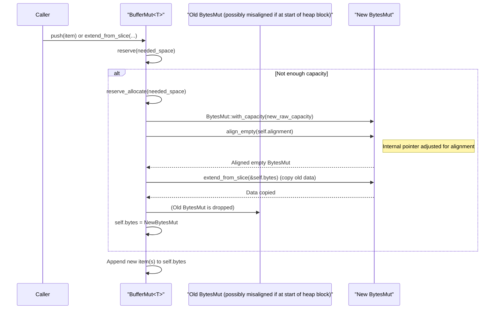

# Chapter 8: Buffer (`Buffer`, `ByteBuffer`)

In the [previous chapter on Statistics (`Stat`, `StatsSet`)](07_statistics___stat____statsset___.md), we learned how Vortex uses metadata to optimize data processing. These statistics, often stored as [Scalar (`Scalar`)](02_scalar___scalar___.md) values, ultimately reside in memory. This chapter delves into the most fundamental data container in Vortex: the `Buffer`. Buffers are the raw, contiguous blocks of memory used to store the actual data for arrays, including their values, validity bitmaps, offsets, and even the serialized representation of their statistics. They are the terminal nodes in the recursive structure of an [Array (`ArrayRef`, `dyn Array`)](03_array___arrayref____dyn_array___.md) where the raw bytes reside.

## The Essence of a Buffer

At its core, a Vortex `Buffer` is a an owned, contiguous region of memory. It's more than just a raw byte sequence; it provides a typed view (`Buffer<T>`) or a generic byte view (`ByteBuffer`, which is an alias for `Buffer<u8>`). A key characteristic of Vortex buffers is their **alignment**. Data within buffers is typically aligned to memory boundaries that are optimal for modern CPU architectures, particularly for Single Instruction, Multiple Data (SIMD) operations. This alignment ensures that vectorized computations can be performed efficiently.

Vortex provides two main buffer types:
1.  **`Buffer<T>`**: An immutable, reference-counted buffer. Its design is heavily inspired by `bytes::Bytes`, enabling zero-copy slicing and cheap cloning (which only increments a reference count).
2.  **`BufferMut<T>`**: A mutable buffer, analogous to `bytes::BytesMut` or `Vec<T>`, but with the added guarantee that reallocation operations preserve its specified alignment.

These buffers form the lowest level of data storage in Vortex before interacting with the operating system's memory management or file I/O.

## Alignment (`Alignment` struct)

Memory alignment is crucial for performance. Many CPU instructions, especially SIMD instructions, require data to be loaded from memory addresses that are multiples of a certain value (e.g., 16, 32, or 64 bytes). Accessing misaligned data can lead to performance penalties or even crashes on some architectures.

Vortex manages alignment using the `Alignment` struct, a newtype wrapper around `std::num::NonZeroUsize` ensuring the alignment value is a power of two.

```rust
// Simplified from vortex-buffer/src/alignment.rs
#[derive(Debug, Copy, Clone, Eq, PartialEq, Hash)]
pub struct Alignment(std::num::NonZeroUsize);

impl Alignment {
    pub fn new(alignment: usize) -> Self {
        // ... panics if alignment is 0 or not a power of two ...
        unimplemented!()
    }

    pub fn of<T>() -> Self {
        // Returns alignment based on std::mem::align_of::<T>()
        // but at least 1.
        unimplemented!()
    }
}
// Allows dereferencing to usize: impl Deref for Alignment { type Target = usize; ... }
```
You can create an `Alignment` instance for a specific type `T` using `Alignment::of::<T>()` or specify a custom power-of-two alignment with `Alignment::new(value)`. When creating buffers, their alignment must be compatible with the alignment of the type `T` they store (i.e., the buffer's alignment must be a multiple of `align_of::<T>()`).

## Immutable Buffers: `Buffer<T>`

The `Buffer<T>` struct provides an immutable, typed view over a contiguous block of memory. It's the primary way immutable data, like the values of a primitive array, is represented at the byte level.

```rust
// Relevant excerpt from vortex-buffer/src/buffer.rs
use bytes::Bytes;
use std::marker::PhantomData;
use crate::Alignment;

#[derive(Clone)] // Cheap, reference-counted clone
pub struct Buffer<T> {
    pub(crate) bytes: Bytes,      // The underlying shared byte storage
    pub(crate) length: usize,     // Number of elements of type T
    pub(crate) alignment: Alignment, // Guaranteed alignment of the data
    pub(crate) _marker: PhantomData<T>, // For type T
}
```
The `bytes` field holds the actual data using `bytes::Bytes`, which handles reference counting and allows for efficient zero-copy slicing. `length` is the number of `T` elements, and `alignment` is the guaranteed memory alignment for the start of the data.

### Creating `Buffer<T>`

Immutable buffers can be created in several ways:
*   From existing data (involving a copy):
    ```rust
    use vortex_buffer::{Buffer, Alignment};

    // From a slice, with default alignment for i32
    let buf_from_slice = Buffer::<i32>::copy_from(&[10, 20, 30]);

    // From a slice, with custom alignment (e.g., 64 bytes)
    // This panics if Alignment::new(64) is not compatible with align_of::<i32>()
    let custom_alignment = Alignment::new(64).unwrap(); // Assuming 64 is valid
    let buf_custom_aligned = Buffer::<i32>::copy_from_aligned(&[1, 2, 3], custom_alignment);
    ```
*   As empty or zeroed buffers:
    ```rust
    use vortex_buffer::{Buffer, Alignment};

    let empty_buf = Buffer::<f64>::empty(); // Default alignment for f64
    let zeroed_buf = Buffer::<u8>::zeroed(1024); // 1024 zeroed bytes
    ```
*   From a `ByteBuffer` (which is `Buffer<u8>`):
    ```rust
    use vortex_buffer::{Buffer, ByteBuffer, Alignment};

    let byte_buffer: ByteBuffer = Buffer::<u8>::copy_from(&[0,0,0,0, 1,0,0,0]); // Two i32s
    // Panics if byte_buffer is not aligned for i32 or length not multiple of size_of::<i32>()
    let int_buffer = Buffer::<i32>::from_byte_buffer(byte_buffer);
    assert_eq!(int_buffer.as_slice(), &[0, 1]);
    ```
*   By `freeze()`-ing a `BufferMut<T>`.

### Accessing Data and Properties
```rust
use vortex_buffer::Buffer;

let buffer = Buffer::<i32>::copy_from(&[1, 2, 3, 4, 5]);

println!("Length: {}", buffer.len()); // Output: Length: 5
println!("Is empty: {}", buffer.is_empty()); // Output: Is empty: false
println!("Alignment: {:?}", buffer.alignment()); // Output: Alignment: Alignment(4) (for i32)

// Access as a slice
let slice: &[i32] = buffer.as_slice();
println!("Slice: {:?}", slice); // Output: Slice: [1, 2, 3, 4, 5]

// Iterate over elements (Buffer<T> implements IntoIterator if T: Copy)
for &value in buffer.iter() { // Assuming T: Copy
    // ... process value ...
}
```

### Zero-Copy Slicing
Thanks to `bytes::Bytes`, slicing a `Buffer<T>` is a cheap, zero-copy operation. It creates a new `Buffer<T>` that shares the underlying memory but with different start/end offsets and length.
```rust
use vortex_buffer::Buffer;

let main_buffer = Buffer::<i32>::copy_from(&[0, 1, 2, 3, 4, 5, 6, 7, 8, 9]);
// Creates a new Buffer viewing elements at index 2, 3, 4
let sliced_buffer: Buffer<i32> = main_buffer.slice(2..5);

assert_eq!(sliced_buffer.as_slice(), &[2, 3, 4]);
// main_buffer and sliced_buffer share the same underlying memory allocation.
```
The `slice_with_alignment` method allows specifying a potentially different (but compatible) alignment for the slice, while `slice_unaligned` creates a slice with byte-alignment (useful for `ByteBuffer`).

### Conversions
A `Buffer<T>` can be converted:
*   To its underlying `Bytes` object: `buffer.into_inner()`.
*   To a `ByteBuffer` (a `Buffer<u8>` view): `buffer.into_byte_buffer()`. This is zero-copy.
*   To a mutable `BufferMut<T>`: `buffer.into_mut()`. This might involve a copy if the buffer is shared (i.e., has multiple references). `try_into_mut()` attempts this without copying if uniquely owned.

## Mutable Buffers: `BufferMut<T>`

`BufferMut<T>` is Vortex's mutable buffer, designed for building up data incrementally while maintaining alignment.

```rust
// Relevant excerpt from vortex-buffer/src/buffer_mut.rs
use bytes::BytesMut;
use std::marker::PhantomData;
use crate::Alignment;

#[derive(PartialEq, Eq)] // Based on content
pub struct BufferMut<T> {
    pub(crate) bytes: BytesMut,   // The underlying mutable byte storage
    pub(crate) length: usize,      // Number of elements of type T
    pub(crate) alignment: Alignment, // Desired alignment, maintained on realloc
    pub(crate) _marker: PhantomData<T>,
}
```
It uses `bytes::BytesMut` internally. The crucial feature is that operations like `reserve` that might reallocate memory will ensure the new memory block is also correctly aligned.

### Creating `BufferMut<T>`
```rust
use vortex_buffer::{BufferMut, Alignment};

// With initial capacity and default alignment for u16
let mut mut_buf1 = BufferMut::<u16>::with_capacity(100);

// With initial capacity and custom alignment
let custom_alignment = Alignment::new(128).unwrap(); // Ensure 128 is valid
let mut mut_buf2 = BufferMut::<u64>::with_capacity_aligned(50, custom_alignment);

// Empty buffer
let mut empty_mut_buf = BufferMut::<i8>::empty();
```

### Modifying `BufferMut<T>`
`BufferMut<T>` supports operations similar to `Vec<T>`:
```rust
use vortex_buffer::BufferMut;

let mut buffer = BufferMut::<i32>::with_capacity(2);
buffer.push(10); // Add an element
buffer.push(20);
assert_eq!(buffer.as_slice(), &[10, 20]);

buffer.extend_from_slice(&[30, 40]);
assert_eq!(buffer.as_slice(), &[10, 20, 30, 40]);

buffer.truncate(3); // Keep first 3 elements
assert_eq!(buffer.as_slice(), &[10, 20, 30]);

buffer.clear(); // Remove all elements, keep capacity
assert!(buffer.is_empty());
```
The `push_unchecked`, `push_n_unchecked` methods offer slightly faster appends if capacity is guaranteed by the caller.

### Alignment-Preserving Reallocation (`reserve` and `reserve_allocate`)
When a `BufferMut<T>` needs to grow beyond its current capacity (e.g., during `push` or `extend_from_slice`), it calls `reserve`. If reallocation is needed, `reserve` delegates to `reserve_allocate`.

```rust
// Simplified logic from BufferMut<T>::reserve_allocate
// fn reserve_allocate(&mut self, additional: usize) {
//     let new_min_items = self.length + additional;
//     let new_byte_capacity = (new_min_items * size_of::<T>()) + *self.alignment;
//     // Potentially increase further (e.g., double current capacity)
//     // let new_byte_capacity = new_byte_capacity.max(self.bytes.capacity() * 2);

//     let mut new_bytes_mut = BytesMut::with_capacity(new_byte_capacity);
//     // Ensure the new BytesMut starts at an aligned address
//     new_bytes_mut.align_empty(self.alignment);
//     new_bytes_mut.extend_from_slice(&self.bytes); // Copy old data
//     self.bytes = new_bytes_mut;
// }
```
The `align_empty` helper (an extension method on `BytesMut`) advances the internal pointer of `new_bytes_mut` past any initial padding to reach an address aligned to `self.alignment` before any data is copied. This ensures the data remains aligned after reallocation.

A conceptual illustration of reallocation while preserving alignment:


### Freezing into `Buffer<T>`
Once a `BufferMut<T>` is fully populated, it can be converted into an immutable `Buffer<T>` efficiently:
```rust
use vortex_buffer::{Buffer, BufferMut};

let mut mut_buffer = BufferMut::<u32>::from_iter(0..100);
// ... populate mut_buffer ...
let immutable_buffer: Buffer<u32> = mut_buffer.freeze();
```
This conversion is typically zero-copy, changing ownership of the underlying `BytesMut` (which becomes `Bytes`).

## `ByteBuffer` and `BufferString`

`ByteBuffer` is a type alias for `Buffer<u8>`, representing an immutable sequence of bytes. `ByteBufferMut` is `BufferMut<u8>`. These are fundamental for storing raw binary data, validity bitmasks, or as the underlying store for other typed buffers.

```rust
// From vortex-buffer/src/lib.rs
pub type ByteBuffer = Buffer<u8>;
pub type ByteBufferMut = BufferMut<u8>;
```

Vortex also provides `BufferString`, a wrapper around `ByteBuffer` that guarantees its contents are valid UTF-8. This is used for string data.
```rust
// From vortex-buffer/src/string.rs
use crate::ByteBuffer;
#[derive(Debug, Clone, PartialEq, Eq, PartialOrd, Ord, Hash)]
pub struct BufferString(ByteBuffer); // Invariant: ByteBuffer contains valid UTF-8
```
Creation of `BufferString` typically involves UTF-8 validation.

## Buffers as Terminal Nodes

In the Vortex array system, data is often structured recursively. For example, a [ListArray (part of `Canonical::List`)](06_canonical_encodings___canonical___.md) contains an offsets array (another `ArrayRef`) and a values array (another `ArrayRef`). This recursion continues until we reach fundamental data, which is stored in Buffers.
For instance, a `PrimitiveArray` (a [Canonical Encodings (`Canonical`)](06_canonical_encodings___canonical___.md) form) directly holds its values in a `Buffer<PType>` and its validity information (if nullable) in an optional `Buffer<u8>` (often a bit-packed `Mask`).

Encodings like RLE or Dictionary will also use Buffers for their components (e.g., run values, run lengths, dictionary values, codes), although these components might themselves be further arrays that eventually resolve to Buffers. Thus, Buffers are the ultimate containers of the raw bytes that constitute the array data.

## Serialization

Vortex `Buffer`s, particularly `ByteBuffer`s, are inherently serializable as they represent contiguous blocks of bytes. When an [Array (`ArrayRef`, `dyn Array`)](03_array___arrayref____dyn_array___.md) is serialized (e.g., to a file), its constituent buffers are written out directly. The metadata about how to interpret these byte sequences (their [DType (`DType`)](01_dtype___dtype___.md), encoding, length, etc.) is stored separately, typically in the array's metadata or file footers.

## Conclusion

Vortex `Buffer`s (`Buffer<T>`, `BufferMut<T>`, and the alias `ByteBuffer`) are the foundational elements for storing raw data in memory. Their key features – typed views, guaranteed alignment critical for SIMD, and efficient zero-copy operations derived from `bytes::Bytes` – make them well-suited for high-performance data processing. As the terminal nodes in the array structure, they hold the actual bytes of array values, validity masks, offsets, and other structural components. Their careful design, especially concerning alignment preservation in `BufferMut<T>`, underpins Vortex's ability to handle data efficiently at its most granular level.

Understanding buffers is key to understanding how Vortex manages memory for its arrays. With this foundation, we can now explore how these buffers, along with array metadata, are organized and persisted on disk. This leads us to the next chapter on [Layout (`Layout`, `LayoutReader`, `LayoutWriter`, `LayoutStrategy`)](09_layout___layout____layoutreader____layoutwriter____layoutstrategy___.md).

---

Generated by [AI Codebase Knowledge Builder](https://github.com/The-Pocket/Tutorial-Codebase-Knowledge)
