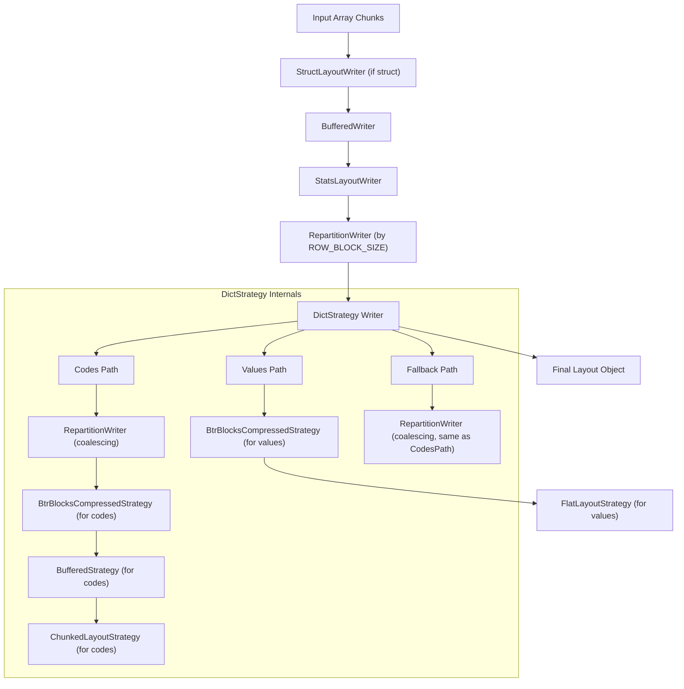
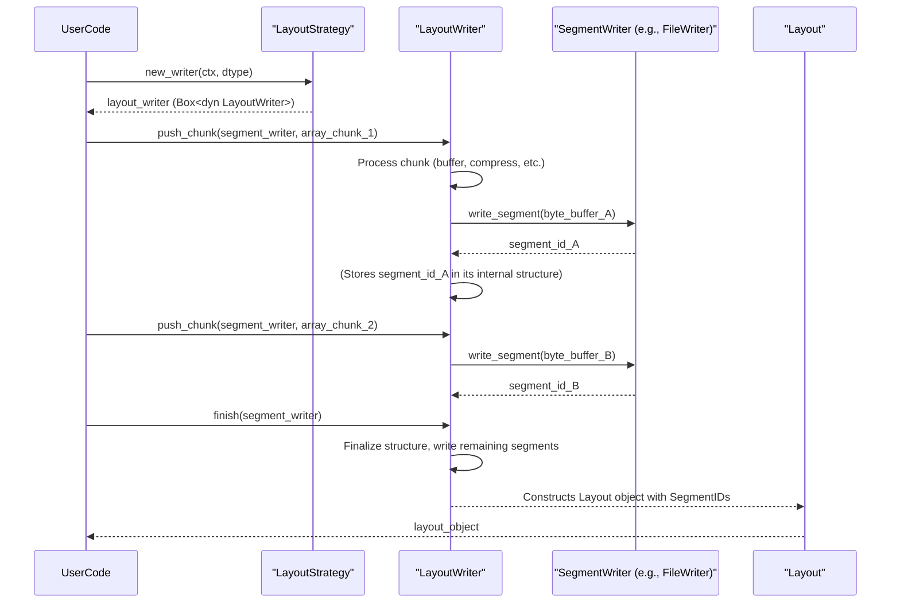
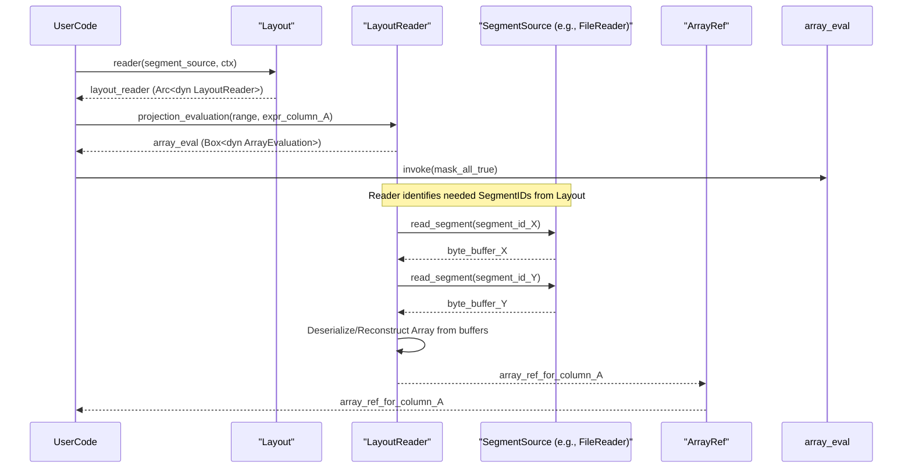

# Chapter 9: Layout (`Layout`, `LayoutReader`, `LayoutWriter`, `LayoutStrategy`)

In the [previous chapter on Buffer (`Buffer`, `ByteBuffer`)](08_buffer___buffer____bytebuffer___.md), we explored the fundamental contiguous memory blocks that hold raw data in Vortex. While buffers store the bytes, we need a higher-level abstraction to describe how collections of these buffers, representing potentially complex and nested [Array (`ArrayRef`, `dyn Array`)](03_array___arrayref____dyn_array___.md)s, are physically organized for on-disk storage or Inter-Process Communication (IPC). This chapter introduces the **Layout** system, which defines this physical organization.

Layouts are recursive structures that describe how data segments (which are essentially [Buffer (`Buffer`, `ByteBuffer`)](08_buffer___buffer____bytebuffer___.md)s) are arranged. This structured description is crucial for enabling efficient random access, data pruning (skipping irrelevant data), and lazy loading of data from persistent storage or during IPC. The Layout system comprises four main components:
1.  `Layout`: The data structure itself, representing the physical organization.
2.  `LayoutStrategy`: Determines *how* a `Layout` is constructed when writing an array.
3.  `LayoutWriter`: The interface responsible for executing a `LayoutStrategy` and writing array chunks into a `Layout`.
4.  `LayoutReader`: The interface for reading data from storage according to a given `Layout`.

This system allows Vortex to separate the logical structure of an array from its physical on-disk or wire representation, offering flexibility in how data is stored and accessed.

## The `Layout` Structure: Describing Physical Organization

A `Layout` in Vortex is a hierarchical description of how an [Array (`ArrayRef`, `dyn Array`)](03_array___arrayref____dyn_array___.md) is stored. It's analogous to an array's in-memory structure but geared towards persistent storage and lazy access. As described in the `docs/concepts/layouts.md` file, a layout logically contains:

*   **VTable (`LayoutVTableRef`)**: Similar to array VTables, this defines the behavior and type of the layout.
*   **Metadata (`Option<Bytes>`)**: Encoding-specific metadata for the layout.
*   **DType (`DType`)**: The logical data type of the array this layout represents.
*   **Row Count (`u64`)**: The number of logical rows in this layout.
*   **Children (`Vec<Layout>`)**: Child layouts, for nested structures like structs or chunked layouts.
*   **Segments (`Vec<SegmentId>`)**: Identifiers for the raw data segments ([Buffer (`Buffer`, `ByteBuffer`)](08_buffer___buffer____bytebuffer___.md)s) used by this layout. These segments are typically stored externally (e.g., in a file).

The `Layout` struct itself is defined in `vortex-layout/src/data.rs` and handles two representations: "Owned" and "Viewed".

```rust
// Simplified from vortex-layout/src/data.rs
#[derive(Debug, Clone)]
pub struct Layout(Inner);

#[derive(Debug, Clone)]
enum Inner {
    Owned(OwnedLayout),
    Viewed(ViewedLayout),
}

// An owned layout is fully deserialized and heap-allocated.
#[derive(Debug, Clone)]
pub struct OwnedLayout {
    name: Arc<str>, // Human-readable name, e.g., "my_array.column_a.chunks"
    vtable: LayoutVTableRef,
    dtype: DType,
    row_count: u64,
    segments: Vec<SegmentId>, // IDs for raw data buffers
    children: Vec<Layout>,    // Child layouts
    metadata: Option<Bytes>,  // Layout-specific metadata
}

// A viewed layout is lazily deserialized from a FlatBuffer message.
#[derive(Debug, Clone)]
struct ViewedLayout {
    name: Arc<str>,
    vtable: LayoutVTableRef,
    dtype: DType,
    flatbuffer: FlatBuffer, // The underlying FlatBuffer
    flatbuffer_loc: usize,  // Location of this layout message in the FlatBuffer
    ctx: LayoutContext,     // Context for deserialization (e.g., encoding lookup)
}
```
`OwnedLayout` represents a layout fully loaded into memory. `ViewedLayout` allows Vortex to lazily parse layout information from a FlatBuffer, which is highly efficient for wide schemas or deeply nested structures as it avoids deserializing the entire layout tree upfront. The `LayoutContext` in `ViewedLayout` helps resolve encoding types and other context-dependent information during lazy deserialization.

Key methods of `Layout` include:
*   `id() -> LayoutId`: Returns the unique identifier string for the layout type (e.g., `vortex.flat`, `vortex.chunked`). `LayoutId` is an `ArcRef<str>`.
*   `dtype() -> &DType`: The logical data type.
*   `row_count() -> u64`: Number of rows.
*   `child(i, dtype, name) -> VortexResult<Layout>`: Gets the i-th child layout.
*   `segments() -> impl Iterator<Item = SegmentId>`: Iterates over the `SegmentId`s, which reference the actual data buffers.
*   `metadata() -> Option<Bytes>`: Retrieves layout-specific metadata.
*   `reader(...) -> VortexResult<Arc<dyn LayoutReader>>`: Creates a `LayoutReader` to access the data.

### Layout VTable (`LayoutVTableRef`)
Each `Layout` type (e.g., Flat, Chunked) has an associated `LayoutVTable` (accessed via `LayoutVTableRef`). This VTable is much simpler than an array's VTable and primarily defines:
*   `id()`: The layout's unique ID.
*   `reader()`: A function to construct a `LayoutReader` for this layout type.
*   `register_splits()`: A function used in query planning to determine optimal read boundaries.

### Built-in Layout Types
Vortex provides several built-in layout types, each identified by a unique `LayoutId`. These are defined as constants in `vortex-layout/src/lib.rs`:
*   **`FLAT_LAYOUT_ID` ("vortex.flat")**: Represents a single, serialized Vortex [Array (`ArrayRef`, `dyn Array`)](03_array___arrayref____dyn_array___.md). It's often a leaf node in a layout tree, directly pointing to the segments containing the array's data.
*   **`STRUCT_LAYOUT_ID` ("vortex.struct")**: Corresponds to a `StructDType`. It has one child `Layout` for each field of the struct. This allows for column pruning, where only requested fields are read.
*   **`CHUNKED_LAYOUT_ID` ("vortex.chunked")**: Partitions data row-wise into multiple child `Layout`s (chunks). It often has an additional child layout storing [Statistics (`Stat`, `StatsSet`)](07_statistics___stat____statsset___.md) for each chunk, enabling pruning of entire chunks based on query predicates.
*   **`STATS_LAYOUT_ID` ("vortex.stats")**: A layout specifically for storing statistics about another layout. It typically wraps a `FlatLayout` containing the statistics array.
*   **`DICT_LAYOUT_ID` ("vortex.dict")**: Represents dictionary-encoded data. It usually has two children: one for the dictionary values and another (often chunked) for the codes.

Future layouts, like `ListLayout` or `MergeLayout`, may be added to further optimize storage and access for specific data patterns.

## `LayoutStrategy`: Defining How Layouts are Constructed

When writing an [Array (`ArrayRef`, `dyn Array`)](03_array___arrayref____dyn_array___.md) to disk or preparing it for IPC, a `LayoutStrategy` determines how the `Layout` tree will be structured. This involves decisions like chunk sizes, compression methods, and whether to use dictionary encoding.

The `LayoutStrategy` trait is defined in `vortex-layout/src/strategy.rs`:
```rust
// From vortex-layout/src/strategy.rs
use vortex_array::ArrayContext;
use vortex_dtype::DType;
use vortex_error::VortexResult;
use crate::writer::LayoutWriter;

pub trait LayoutStrategy: 'static + Send + Sync {
    fn new_writer(&self, ctx: &ArrayContext, dtype: &DType) -> VortexResult<Box<dyn LayoutWriter>>;
}
```
The core method `new_writer` takes an `ArrayContext` (providing global context like compression settings) and the [DType (`DType`)](01_dtype___dtype___.md) of the array to be written, and returns a `LayoutWriter` instance configured according to the strategy.

A simple strategy might be `StructStrategy` (also from `vortex-layout/src/strategy.rs`), which handles struct arrays by creating a `StructLayoutWriter` and uses a `FlatLayoutWriter` for all other types.

```rust
// Simplified from vortex-layout/src/strategy.rs
pub struct StructStrategy;

impl LayoutStrategy for StructStrategy {
    fn new_writer(&self, ctx: &ArrayContext, dtype: &DType) -> VortexResult<Box<dyn LayoutWriter>> {
        if dtype.is_struct() { // DType::Struct variant
            StructLayoutWriter::try_new_with_strategy(ctx, dtype, StructStrategy)
                .map(|w| w.boxed()) // .boxed() is from LayoutWriterExt
        } else {
            Ok(FlatLayoutWriter::new(ctx.clone(), dtype.clone(), Default::default()).boxed())
        }
    }
}
```

More complex strategies can be composed. For example, the `VortexLayoutStrategy` in `vortex-file/src/strategy.rs` defines a default strategy for writing Vortex files. It chains multiple simpler strategies:
1.  **`StructLayoutWriter`**: Unwraps struct arrays.
2.  **`BufferedStrategy`**: Buffers array chunks in memory (e.g., up to 2MB) before passing them to the next stage. This helps group data for a column.
3.  **`BtrBlocksCompressedStrategy`**: Compresses chunks using BtrBlocks, potentially reusing previous compression hints.
4.  **`RepartitionStrategy`**: Re-chunks data based on size (e.g., 1MB blocks) or row count multiples (e.g., 8192 rows). This is applied *before* compression in `VortexLayoutStrategy`.
5.  **`DictStrategy`**: Applies dictionary encoding if beneficial. It uses different strategies for codes and values.
6.  **`StatsLayoutWriter`**: Computes and writes statistics for data chunks.
7.  Finally, another `RepartitionWriter` ensures fixed row-block sizes (e.g., 8192 rows) for the outermost structure.

This composition allows for sophisticated, multi-stage layout construction. Each intermediate strategy in the chain produces a `LayoutWriter` that then acts as the "child" writer for the next strategy encapsulating it.


The diagram above conceptualizes the flow within a sophisticated strategy like `VortexLayoutStrategy`. A chunk of an array to be written passes through various writers, each potentially transforming, re-chunking, compressing, or adding metadata, before the final `Layout` object is produced.

## `LayoutWriter`: Executing the Strategy

A `LayoutWriter`, returned by `LayoutStrategy::new_writer()`, is responsible for taking incoming [Array (`ArrayRef`, `dyn Array`)](03_array___arrayref____dyn_array___.md) chunks and organizing them into a `Layout`. The trait is defined in `vortex-layout/src/writer.rs`:

```rust
// From vortex-layout/src/writer.rs
use vortex_array::ArrayRef;
use vortex_error::VortexResult;
use crate::Layout;
use crate::segments::SegmentWriter; // To write raw byte segments

pub trait LayoutWriter: Send {
    fn push_chunk(
        &mut self,
        segment_writer: &mut dyn SegmentWriter, // Interface to write physical segments
        chunk: ArrayRef,
    ) -> VortexResult<()>;

    fn flush(&mut self, segment_writer: &mut dyn SegmentWriter) -> VortexResult<()>;

    fn finish(&mut self, segment_writer: &mut dyn SegmentWriter) -> VortexResult<Layout>;
}
```
*   `push_chunk()`: Accepts an array chunk. The writer might buffer it, compress it, write it immediately, or pass it to child writers. It uses the provided `SegmentWriter` to persist any raw byte [Buffer (`Buffer`, `ByteBuffer`)](08_buffer___buffer____bytebuffer___.md)s, obtaining `SegmentId`s in return.
*   `flush()`: Forces any buffered data to be written through the `SegmentWriter`.
*   `finish()`: Finalizes the writing process, flushes any remaining data, and returns the constructed `Layout` object describing the written data.

The `SegmentWriter` (from `vortex-layout/src/segments.rs`) is a crucial collaborator. It abstracts the actual storage mechanism, providing methods like `write_segment(buffer: ByteBuffer) -> VortexResult<SegmentId>`. The `LayoutWriter` hands byte buffers to the `SegmentWriter` and incorporates the returned `SegmentId`s into the `Layout` structure.

Consider the `BufferedWriter` from `vortex-file/src/strategy.rs` as an example:
```rust
// Simplified from vortex-file/src/strategy.rs (part of VortexLayoutStrategy)
struct BufferedWriter {
    chunks: VecDeque<ArrayRef>,     // In-memory buffer for chunks
    nbytes: u64,                    // Current size of buffered chunks
    buffer_size: u64,               // Target buffer size before flushing
    child: Box<dyn LayoutWriter>,   // The next writer in the chain
}

impl LayoutWriter for BufferedWriter {
    fn push_chunk(
        &mut self,
        segment_writer: &mut dyn SegmentWriter,
        chunk: ArrayRef,
    ) -> VortexResult<()> {
        self.nbytes += chunk.nbytes() as u64;
        self.chunks.push_back(chunk);
        // If buffer grows too large, flush some chunks to the child writer
        if self.nbytes >= 2 * self.buffer_size {
            while self.nbytes > self.buffer_size {
                if let Some(c) = self.chunks.pop_front() {
                    self.nbytes -= c.nbytes() as u64;
                    self.child.push_chunk(segment_writer, c)?; // Pass to next stage
                } // ...
            }
        }
        Ok(())
    }
    // flush() iterates through remaining self.chunks and calls self.child.push_chunk().
    // finish() calls self.child.finish() to get the Layout from the next stage.
    // ...
}
```
This `BufferedWriter` accumulates chunks until `buffer_size` is exceeded, then pushes older chunks to its `child` writer.

## `LayoutReader`: Accessing Data via Layouts

Once a `Layout` is defined (either by writing or by loading from a file), a `LayoutReader` provides the means to read the data. The `LayoutReader` trait is defined in `vortex-layout/src/reader.rs`.

```rust
// Simplified from vortex-layout/src/reader.rs
use vortex_array::ArrayRef;
use vortex_dtype::DType;
use vortex_error::VortexResult;
use crate::Layout; // The Layout object describing the data

pub trait LayoutReader: 'static + ExprEvaluator { // ExprEvaluator for query processing
    fn layout(&self) -> &Layout;
    fn row_count(&self) -> u64 { self.layout().row_count() }
    fn dtype(&self) -> &DType { self.layout().dtype() }
    fn children(&self) -> VortexResult<Vec<Arc<dyn LayoutReader>>>;
}

// ExprEvaluator part (simplified)
pub trait ExprEvaluator: Send + Sync {
    // Methods for different evaluation phases, e.g., projection
    fn projection_evaluation(
        &self,
        row_range: &Range<u64>,
        expr: &ExprRef, // Expression to evaluate (e.g., column name)
    ) -> VortexResult<Box<dyn ArrayEvaluation>>;
}

#[async_trait]
pub trait ArrayEvaluation: 'static + Send + Sync {
    async fn invoke(&self, mask: Mask) -> VortexResult<ArrayRef>; // Returns an array
}
```
A `LayoutReader` is created from a `Layout` object using `layout.reader(segment_source, array_ctx)`. The `SegmentSource` (from `vortex-layout/src/segments.rs`) is the counterpart to `SegmentWriter`; it's responsible for fetching raw data segments (byte buffers) given their `SegmentId`s.

The `LayoutReader`'s primary role, especially for query processing, is to implement `ExprEvaluator`. This trait allows the reader to:
*   Perform pruning based on an expression (`pruning_evaluation`).
*   Evaluate filter predicates (`filter_evaluation`).
*   Project columns or evaluate expressions to produce resulting arrays (`projection_evaluation`).

The `projection_evaluation` method, for example, takes a row range and an expression (which might just be a column name or a more complex function). It returns an `ArrayEvaluation` object. The `invoke` method of `ArrayEvaluation` can then be called (asynchronously) with a `Mask` (indicating which rows within the range are selected) to produce the final `ArrayRef`.

For a `FlatLayout`, its reader (`FlatLayoutReader`) would, during `projection_evaluation`, use the `SegmentSource` to fetch the necessary byte segments for the requested array, deserialize the array from these segments, and return it. For a `ChunkedLayout`, its reader would first use statistics to prune chunks, then delegate to the readers of the relevant child chunks.

### Internal Flow: Writing an Array

The process of writing an [Array (`ArrayRef`, `dyn Array`)](03_array___arrayref____dyn_array___.md) using the layout system can be visualized as follows:


The `LayoutWriter` orchestrates the process, using the `SegmentWriter` to handle the low-level storage of byte segments and ultimately producing a `Layout` object that references these segments.

### Internal Flow: Reading an Array

Reading data involves a `LayoutReader` using a `SegmentSource` to reconstruct array parts:


The `LayoutReader`, guided by the `Layout` structure, determines which segments are needed, fetches them via `SegmentSource`, and then reconstructs the requested `ArrayRef`. Pruning and lazy loading are key benefits here; only necessary segments are read and processed.

## Serialization of `Layout` Objects

`Layout` objects themselves need to be persisted, typically as part of a file's metadata (footer). As seen in `vortex-layout/src/data.rs`, `Layout` provides `flatbuffer_writer()` which returns a `LayoutFlatBufferWriter`. This writer serializes the `Layout` (including its children, segment references, and metadata) into a FlatBuffer. This FlatBuffer representation can then be stored. When reading a file, this FlatBuffer is loaded, and `Layout::new_viewed_unchecked()` is used to create `ViewedLayout` instances, enabling lazy access to the layout structure.

## Conclusion

The Layout system (`Layout`, `LayoutReader`, `LayoutWriter`, `LayoutStrategy`) provides a comprehensive framework for defining and managing the physical organization of serialized arrays. It decouples the logical array structure from its on-disk or IPC representation, enabling sophisticated strategies for chunking, compression, and metadata storage. `LayoutStrategy` and `LayoutWriter` handle the construction of these layouts, while `LayoutReader` provides efficient, potentially lazy and pruning-aware access to the data. This system is fundamental to how Vortex handles persistent storage and data exchange.

With the concepts of logical data types, arrays, encodings, computations, statistics, buffers, and now physical layouts covered, we are ready to see how these components come together to define a complete Vortex file. The next chapter will explore the [VortexFile (`VortexFile`, `Footer`, `SegmentSpec`)](10_vortexfile___vortexfile____footer____segmentspec___.md).

---

Generated by [AI Codebase Knowledge Builder](https://github.com/The-Pocket/Tutorial-Codebase-Knowledge)
