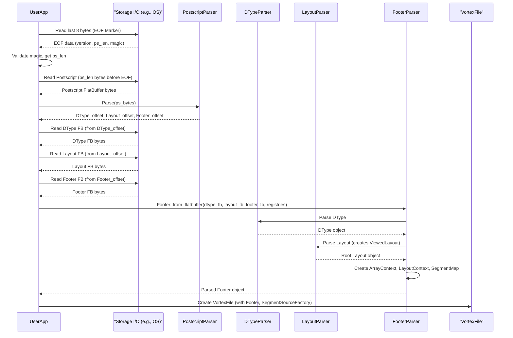
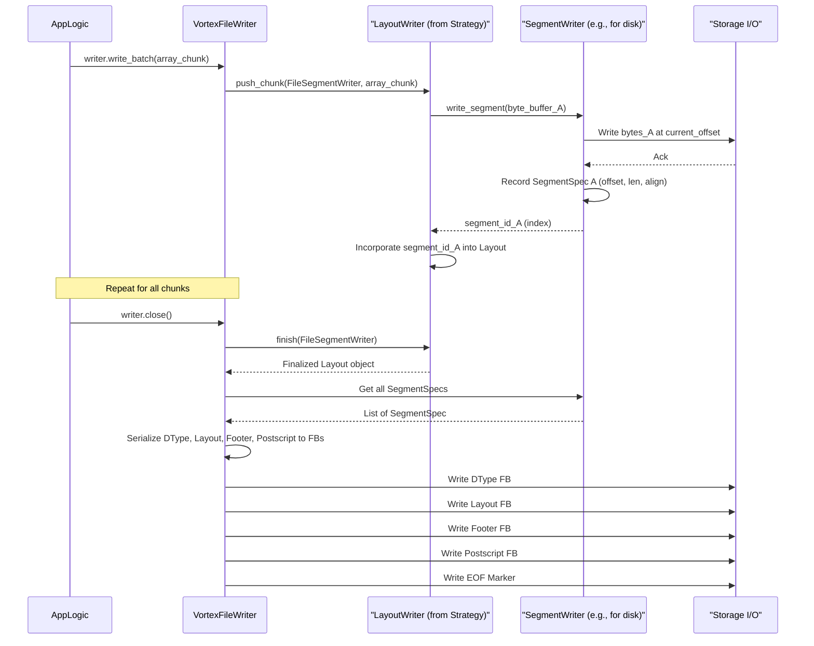

# Chapter 10: VortexFile (`VortexFile`, `Footer`, `SegmentSpec`)

In the [previous chapter on Layout (`Layout`, `LayoutReader`, `LayoutWriter`, `LayoutStrategy`)](09_layout___layout____layoutreader____layoutwriter____layoutstrategy___.md), we explored how Vortex describes the physical organization of serialized arrays. This logical description, the `Layout`, needs to be anchored to a concrete file format to enable persistent storage and exchange of Vortex data. This chapter introduces the `VortexFile`, which represents a complete, self-contained Vortex file on a storage medium. It brings together all the concepts we've discussed—[DType (`DType`)](01_dtype___dtype___.md)s, [Array (`ArrayRef`, `dyn Array`)](03_array___arrayref____dyn_array___.md)s, [Encoding (`EncodingRef`, `VTable` trait and macro)](04_encoding___encodingref____vtable__trait_and_macro__.md)s, [Buffer (`Buffer`, `ByteBuffer`)](08_buffer___buffer____bytebuffer___.md)s, [Statistics (`Stat`, `StatsSet`)](07_statistics___stat____statsset___.md), and [Layout (`Layout`, `LayoutReader`, `LayoutWriter`, `LayoutStrategy`)](09_layout___layout____layoutreader____layoutwriter____layoutstrategy___.md)s—into a tangible file structure.

A `VortexFile` encapsulates the file's metadata, stored in a `Footer`, and provides access to the actual data segments. The `Footer` is critical: it contains the root `Layout` describing the data's structure within the file, the file's overall [DType (`DType`)](01_dtype___dtype___.md), and a map (`SegmentSpec`s) detailing the physical locations of data blocks (segments) within the file. `VortexFile` provides methods for scanning and reading this data, bridging the gap between the abstract `Layout` and a physical file.

## Overview of the Vortex File Format

A Vortex file is structured to enable efficient reading, particularly for columnar data access and predicate pushdown. The file format, as detailed in `vortex-file/src/lib.rs` and `docs/specs/file-format.md`, consists of several key parts, typically arranged as follows from the beginning to the end of the file:

1.  **Data Segments**: These are the raw byte [Buffer (`Buffer`, `ByteBuffer`)](08_buffer___buffer____bytebuffer___.md)s that make up the array data. They can be interleaved, but often, "data" arrays (e.g., column values) are written before "metadata" arrays (e.g., per-column statistics) to improve locality for certain access patterns.
2.  **Schema (DType) FlatBuffer**: A FlatBuffer message serializing the root [DType (`DType`)](01_dtype___dtype___.md) of the data stored in the file.
3.  **Layout FlatBuffer**: A FlatBuffer message serializing the root [Layout (`Layout`, `LayoutReader`, `LayoutWriter`, `LayoutStrategy`)](09_layout___layout____layoutreader____layoutwriter____layoutstrategy___.md) object. This describes the hierarchical structure of the data segments.
4.  **Footer FlatBuffer**: A FlatBuffer message containing:
    *   `array_specs` and `layout_specs`: Information to reconstruct `ArrayContext` and `LayoutContext`, enabling resolution of custom encodings and layout types.
    *   `segment_specs`: A list of `SegmentSpec` objects, mapping logical segment identifiers used in the `Layout` to their physical byte offsets and lengths within the file.
5.  **Postscript FlatBuffer**: A small FlatBuffer message containing the absolute byte offsets within the file where the Schema FlatBuffer and Layout FlatBuffer begin. It also contains the offset to the Footer FlatBuffer.
6.  **End-of-File (EOF) Marker**: A fixed-size (8-byte) marker containing:
    *   `version (u16)`: The version of the Vortex file format.
    *   `postscript_length (u16)`: The length of the Postscript FlatBuffer.
    *   `magic_bytes (4 bytes)`: The sequence `VTXF` identifying it as a Vortex file.

The file typically ends with the magic number `VTXF` as part of the EOF marker. Another `VTXF` sequence might also be present at the very beginning of the file, although the primary identification and metadata parsing starts from the end.

```mermaid
graph TB
    subgraph File Structure (Top to Bottom)
        direction TB
        DataSegments["Data Segments (Raw Byte Buffers)"]
        StatisticsSegments["Statistics Segments (Optional, also Raw Byte Buffers)"]
        SchemaFB["Schema (DType) FlatBuffer"]
        LayoutFB["Layout FlatBuffer"]
        FooterFB["Footer FlatBuffer (SegmentMap, Array/Layout Specs)"]
        PostscriptFB["Postscript FlatBuffer (Offsets to Schema, Layout, Footer)"]
        EOFMarker["EOF Marker (Version, Postscript Length, Magic 'VTXF')"]

        DataSegments --> StatisticsSegments;
        StatisticsSegments --> SchemaFB;
        SchemaFB --> LayoutFB;
        LayoutFB --> FooterFB;
        FooterFB --> PostscriptFB;
        PostscriptFB --> EOFMarker;
    end

    style DataSegments fill:#cde,stroke:#333
    style StatisticsSegments fill:#cde,stroke:#333
    style SchemaFB fill:#f9c,stroke:#333
    style LayoutFB fill:#f9c,stroke:#333
    style FooterFB fill:#f9c,stroke:#333
    style PostscriptFB fill:#f9c,stroke:#333
    style EOFMarker fill:#f99,stroke:#333
```
This structure, particularly placing metadata at the end, allows readers to quickly access the `Footer` by reading a small portion from the end of the file, without needing to scan the entire file first.

## Core Components: `VortexFile`, `Footer`, `SegmentSpec`

Let's examine the Rust structs that represent these concepts.

### `VortexFile`

The `VortexFile` struct, defined in `vortex-file/src/file.rs`, is the primary handle to an opened Vortex file.

```rust
// Simplified from vortex-file/src/file.rs
use std::sync::Arc;
use vortex_array::ArrayRef;
use vortex_dtype::DType;
use vortex_layout::LayoutReader;
use vortex_layout::scan::ScanBuilder;
use vortex_layout::segments::SegmentSource;
use vortex_metrics::VortexMetrics;
use crate::footer::Footer;

#[derive(Clone)]
pub struct VortexFile {
    pub(crate) footer: Footer,
    pub(crate) segment_source_factory: Arc<dyn SegmentSourceFactory>,
    pub(crate) metrics: VortexMetrics,
}

impl VortexFile {
    pub fn footer(&self) -> &Footer { &self.footer }
    pub fn row_count(&self) -> u64 { self.footer.row_count() }
    pub fn dtype(&self) -> &DType { self.footer.dtype() }
    pub fn segment_source(&self) -> Arc<dyn SegmentSource> {
        self.segment_source_factory.segment_source(self.metrics.clone())
    }
    pub fn layout_reader(&self) -> VortexResult<Arc<dyn LayoutReader>> {
        // ... uses self.segment_source() and self.footer ...
        unimplemented!()
    }
    pub fn scan(&self) -> VortexResult<ScanBuilder<ArrayRef>> {
        // ... uses self.layout_reader() ...
        unimplemented!()
    }
    // ... other methods like file_stats(), metrics() ...
}

// SegmentSourceFactory is responsible for creating SegmentSource instances.
pub trait SegmentSourceFactory: 'static + Send + Sync {
    fn segment_source(&self, metrics: VortexMetrics) -> Arc<dyn SegmentSource>;
}
```
A `VortexFile` instance holds:
*   `footer`: The parsed `Footer` object containing all metadata.
*   `segment_source_factory`: A factory to create `SegmentSource` instances. `SegmentSource` is a trait (from `vortex-layout`) that abstracts the reading of raw data segments from the underlying storage (e.g., local file, object store).
*   `metrics`: For tracking performance metrics.

It provides methods to access metadata from the footer (like `row_count`, `dtype`) and to obtain a `LayoutReader` or initiate a `ScanBuilder` for reading the file's data, as discussed in the [Layout chapter](09_layout___layout____layoutreader____layoutwriter____layoutstrategy___.md).

### `Footer`

The `Footer` struct, defined in `vortex-file/src/footer/mod.rs`, consolidates all the critical metadata read from the file's end.

```rust
// Simplified from vortex-file/src/footer/mod.rs
use std::sync::Arc;
use vortex_array::{ArrayContext, stats::StatsSet};
use vortex_dtype::DType;
use vortex_layout::{Layout, LayoutContext};
use crate::footer::SegmentSpec; // Renamed from FileSegmentSpec to SegmentSpec

#[derive(Debug, Clone)]
pub struct Footer {
    array_ctx: ArrayContext,
    layout_ctx: LayoutContext,
    root_layout: Layout,
    segments: Arc<[SegmentSpec]>, // The segment map
    statistics: Option<FileStatistics>, // Wraps Arc<[StatsSet]>
}

// Structure to hold file-level statistics (simplified)
#[derive(Debug, Clone)]
pub(crate) struct FileStatistics(pub Arc<[StatsSet]>);


impl Footer {
    pub fn layout(&self) -> &Layout { &self.root_layout }
    pub fn segment_map(&self) -> &Arc<[SegmentSpec]> { &self.segments }
    pub fn dtype(&self) -> &DType { self.root_layout.dtype() }
    pub fn row_count(&self) -> u64 { self.root_layout.row_count() }
    pub fn ctx(&self) -> &ArrayContext { &self.array_ctx }
    // ... other methods like layout_ctx(), statistics() ...
}
```
The `Footer` contains:
*   `array_ctx`: An `ArrayContext` (from `vortex-array`) for resolving [Encoding (`EncodingRef`, `VTable` trait and macro)](04_encoding___encodingref____vtable__trait_and_macro__.md) types. It's initialized using `array_specs` from the Footer FlatBuffer and a global `ArrayRegistry` (like `DEFAULT_REGISTRY` in `vortex-file`).
*   `layout_ctx`: A `LayoutContext` (from `vortex-layout`) for resolving `Layout` types, initialized similarly.
*   `root_layout`: The main [Layout (`Layout`, `LayoutReader`, `LayoutWriter`, `LayoutStrategy`)](09_layout___layoutreader____layoutwriter____layoutstrategy___.md) object describing the structure of the data in the file. This is often a `ViewedLayout` for lazy parsing.
*   `segments`: An `Arc<[SegmentSpec]>`, which is the **segment map**. It's a list of `SegmentSpec` objects detailing the physical location of each data segment.
*   `statistics`: Optional file-level [Statistics (`Stat`, `StatsSet`)](07_statistics___stat____statsset___.md).

### `SegmentSpec`

A `SegmentSpec` (from `vortex-file/src/footer/segment.rs`) describes a single contiguous block of data within the file.

```rust
// From vortex-file/src/footer/segment.rs
use std::ops::Range;
use vortex_buffer::Alignment;

#[derive(Clone, Debug)]
pub struct SegmentSpec {
    pub offset: u64,      // Byte offset from the start of the file
    pub length: u32,      // Length of the segment in bytes
    pub alignment: Alignment, // Memory alignment requirement
}

impl SegmentSpec {
    pub fn byte_range(&self) -> Range<u64> {
        self.offset..self.offset + u64::from(self.length)
    }
}
```
The `Layout` object contains logical `SegmentId`s (often indices). These `SegmentId`s are used to look up the corresponding `SegmentSpec` in the `Footer::segments` array. The `SegmentSource` then uses the `SegmentSpec` (offset and length) to read the correct byte range from the physical storage.

## Reading a Vortex File

The process of opening and reading a `VortexFile` typically involves these steps:

1.  **Locate EOF Marker**: Read the last 8 bytes of the file to get the magic number, version, and Postscript length. Validate the magic number.
2.  **Read Postscript**: Using the Postscript length, read the Postscript FlatBuffer. This gives offsets to the Schema (DType), Layout, and Footer FlatBuffers.
3.  **Read Metadata FlatBuffers**: Read the DType, Layout, and Footer FlatBuffers from their respective offsets.
4.  **Parse `Footer`**: The core step is `Footer::from_flatbuffer(...)`. This function takes the raw bytes of the DType, Layout, and Footer FlatBuffers, along with registries for encodings and layouts (e.g., `DEFAULT_REGISTRY`).
    *   It parses the `fb::Footer` message to extract `array_specs` and `layout_specs`. These are used with the registries to create `ArrayContext` and `LayoutContext`. These contexts are vital for understanding any custom or non-canonical encodings/layouts used in the file.
    *   It parses the `fb::Layout` message using the `LayoutContext` and the DType to create the root `Layout` object. This is often a `ViewedLayout` for lazy processing.
    *   It extracts `segment_specs` from `fb::Footer` to build the `Arc<[SegmentSpec]>` map.
    *   File-level statistics are also loaded if present.
5.  **Instantiate `VortexFile`**: With the parsed `Footer` and a `SegmentSourceFactory` (which depends on how the file is being accessed, e.g., local filesystem, object store), a `VortexFile` object is created.
6.  **Access Data**: The user can then call `vortex_file.scan()` or `vortex_file.layout_reader()` to start reading array data, which uses the `LayoutReader` mechanism from Chapter 9. The `LayoutReader` will use the `SegmentSource` (created by the factory) and the `SegmentSpec`s from the `Footer` to fetch the required raw data segments.

Here's a simplified sequence diagram for opening a file:


## Writing a Vortex File

Writing a Vortex file involves several coordinated steps, managed by a high-level writer (like `VortexFileWriter` from `vortex-file/src/writer.rs`):

1.  **Initialize `LayoutWriter`**: Based on a `LayoutStrategy` (e.g., `VortexLayoutStrategy`), a root `LayoutWriter` is created.
2.  **Initialize `SegmentWriter`**: A `SegmentWriter` (e.g., `FileSegmentWriter`) is set up to handle writing raw byte buffers to the storage medium and tracking their `SegmentSpec`s.
3.  **Process Array Chunks**:
    *   The application pushes [Array (`ArrayRef`, `dyn Array`)](03_array___arrayref____dyn_array___.md) chunks to the `LayoutWriter`.
    *   The `LayoutWriter` (which might be a chain of writers as seen in Chapter 9) processes these chunks (compressing, re-chunking, calculating statistics, etc.).
    *   When a `LayoutWriter` needs to persist a [Buffer (`Buffer`, `ByteBuffer`)](08_buffer___buffer____bytebuffer___.md) (e.g., a compressed block, a validity bitmap), it passes the `ByteBuffer` to the `SegmentWriter`.
    *   The `SegmentWriter` writes the buffer to storage, records its physical `offset` and `length`, and returns a logical `SegmentId` (typically an index) to the `LayoutWriter`.
    *   The `LayoutWriter` incorporates this `SegmentId` into the `Layout` structure it's building.
4.  **Finalize `Layout`**: After all chunks are processed, `layout_writer.finish()` is called. This finalizes the `Layout` object. The `SegmentWriter` now holds a list of all `SegmentSpec`s for the data written.
5.  **Serialize Metadata**:
    *   Serialize the root [DType (`DType`)](01_dtype___dtype___.md) to its FlatBuffer representation.
    *   Serialize the finalized `Layout` object to its FlatBuffer representation.
    *   Create the `fb::Footer` FlatBuffer message, including:
        *   The list of `SegmentSpec`s obtained from the `SegmentWriter`.
        *   `array_specs` and `layout_specs` (derived from the `ArrayContext` and `LayoutContext` used during writing).
        *   References to the DType and Layout FlatBuffers (these might be stored contiguously or their offsets recorded).
    *   Create the Postscript FlatBuffer, recording the offsets where the DType, Layout, and Footer FlatBuffers will be/were written.
6.  **Write to Storage**:
    *   The data segments (managed by `SegmentWriter`) are already written or flushed.
    *   Write the DType FlatBuffer.
    *   Write the Layout FlatBuffer.
    *   Write the Footer FlatBuffer.
    *   Write the Postscript FlatBuffer.
    *   Write the 8-byte EOF marker (version, Postscript length, magic bytes).

The `VortexFileWriter` typically buffers metadata FlatBuffers in memory and writes them out after all data segments are written.



## Key Design Considerations

*   **Random Access and Pruning**: The metadata-at-the-end design, combined with the `Layout` structure (especially `ChunkedLayout` with statistics), allows for efficient random access and pruning of data without reading the entire file.
*   **Lazy Loading**: `ViewedLayout` and on-demand segment reading via `SegmentSource` enable lazy loading of data.
*   **Extensibility**: The use of `ArrayContext` and `LayoutContext` (built from registries) allows files to contain custom encodings or layout types, as long as the reader has access to the corresponding implementations (potentially via Wasm for forward compatibility, as mentioned in `docs/specs/file-format.md`).
*   **Storage Abstraction**: `SegmentSource` and `SegmentWriter` decouple the file logic from the specifics of the storage medium.

## Conclusion

The `VortexFile`, along with its `Footer` and `SegmentSpec` components, defines a complete and robust file format for persisting Vortex arrays. It meticulously organizes data segments and metadata (DType, Layout, statistics, segment map) to support efficient querying, lazy loading, and data pruning. By standardizing how all the core Vortex abstractions are laid out on disk, it provides a solid foundation for data storage and exchange in the Vortex ecosystem.

This chapter concludes our deep dive into the core concepts of the Vortex project. We have journeyed from the logical definition of data types ([DType (`DType`)](01_dtype___dtype___.md)) and single values ([Scalar (`Scalar`)](02_scalar___scalar___.md)), through collections of data in [Array (`ArrayRef`, `dyn Array`)](03_array___arrayref____dyn_array___.md)s with various [Encoding (`EncodingRef`, `VTable` trait and macro)](04_encoding___encodingref____vtable__trait_and_macro__.md)s, to how [Compute Kernels (`ComputeFn`, `Kernel` trait, various specific kernel traits)](05_compute_kernels___computefn____kernel__trait__various_specific_kernel_traits__.md) operate on them. We've seen the importance of [Canonical Encodings (`Canonical`)](06_canonical_encodings___canonical___.md) for standardization, [Statistics (`Stat`, `StatsSet`)](07_statistics___stat____statsset___.md) for optimization, [Buffer (`Buffer`, `ByteBuffer`)](08_buffer___buffer____bytebuffer___.md)s as the raw memory containers, and [Layout (`Layout`, `LayoutReader`, `LayoutWriter`, `LayoutStrategy`)](09_layout___layout____layoutreader____layoutwriter____layoutstrategy___.md)s for physical organization, all culminating in the definition of a `VortexFile`. This comprehensive set of abstractions positions Vortex as a powerful and flexible framework for data processing.

---

Generated by [AI Codebase Knowledge Builder](https://github.com/The-Pocket/Tutorial-Codebase-Knowledge)
